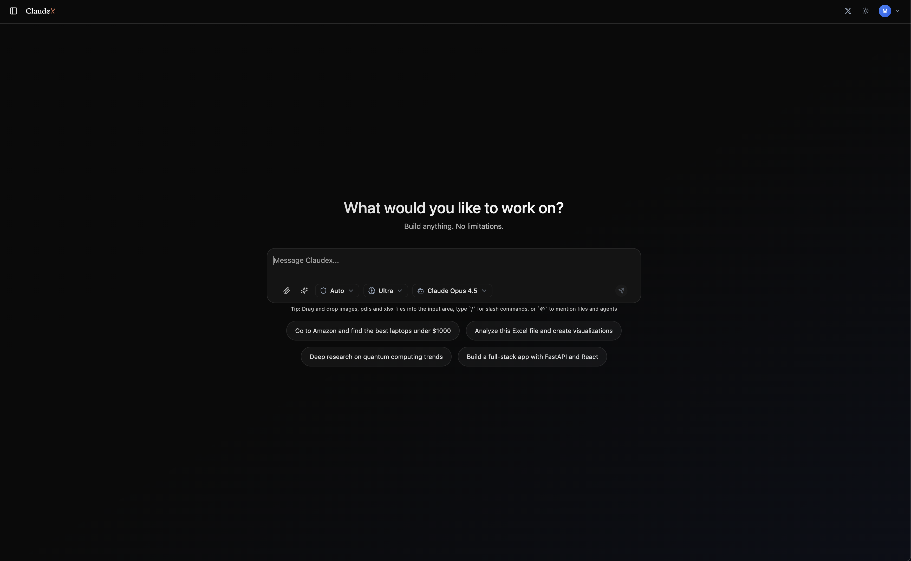
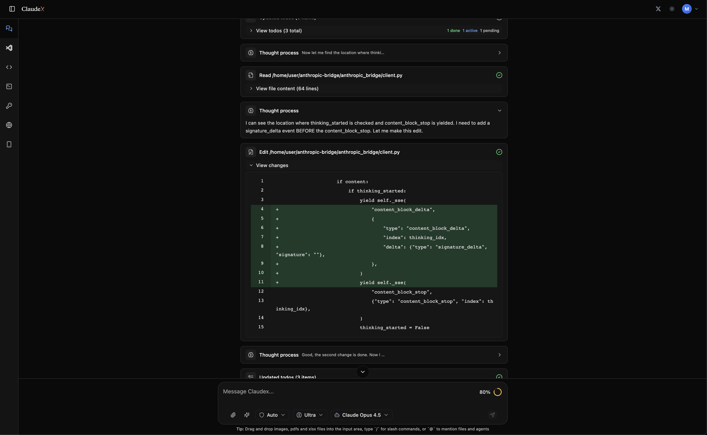

# Claudex

Your own Claude Code UI. Open source, self-hosted, runs entirely on your machine.

**Try it live:** [claudex.pro](https://claudex.pro)

[](https://opensource.org/licenses/MIT)
[](https://www.python.org/)
[](https://reactjs.org/)
[](https://fastapi.tiangolo.com/)

## Why Claudex?

- **Local or cloud sandbox** - Run locally with Docker or in the cloud with E2B.
- **Use your own plans** - Claude Max, Z.AI Coding, or OpenRouter.
- **Full IDE experience** - VS Code in browser, terminal, file explorer.
- **Extensible** - Skills, agents, slash commands, MCP servers.

## Screenshots





## Quick Start

```bash
git clone https://github.com/Mng-dev-ai/claudex.git
cd claudex
docker compose up -d
```

Open http://localhost:3000

## Features

### Sandboxed Code Execution
Run AI agents in isolated environments. Choose between:
- **Docker** - Local execution, no external dependencies
- **E2B** - Cloud execution via [E2B](https://e2b.dev)

### Full Development Environment
- VS Code editor in the browser
- Terminal with full PTY support
- File system management
- Port forwarding for web previews
- Environment checkpoints and snapshots

### Multiple AI Providers
Switch between providers in the same chat:
- **Anthropic** - Use your [Max plan](https://claude.com/pricing/max)
- **Z.AI** - Use your [Coding plan](https://z.ai/subscribe)
- **OpenRouter** - Access to multiple model providers

### Extend with Skills & Agents
- **Custom Skills** - ZIP packages with YAML metadata
- **Custom Agents** - Define agents with specific tool configurations
- **Slash Commands** - Built-in (`/context`, `/compact`, `/review`, `/init`)
- **MCP Servers** - Model Context Protocol support (NPX, BunX, UVX, HTTP)

### Scheduled Tasks
Automate recurring tasks with Celery workers.

## Configuration

Configure in the Settings UI after login:

| Setting | Description |
|---------|-------------|
| Sandbox Provider | Docker (local) or E2B (cloud) |
| E2B API Key | Only needed if using E2B sandbox |
| Claude OAuth Token | For Max plan |
| Z.AI API Key | For Coding plan |
| OpenRouter API Key | For OpenRouter models |

You only need one AI provider key.

### Local Development with Permissions

**Docker Sandbox:**
No tunnel needed. Docker containers connect via `host.docker.internal`.

**E2B Sandbox:**
E2B sandboxes run remotely and cannot reach `localhost`. Expose your backend via a tunnel:

```bash
# Using ngrok
ngrok http 8080

# Or Cloudflare Tunnel
cloudflared tunnel --url http://localhost:8080
```

Then set `BASE_URL` to your tunnel URL:

```bash
BASE_URL=https://your-tunnel-url.ngrok.io docker compose up -d
```

## Architecture

```
┌─────────────────┐     ┌─────────────────┐     ┌─────────────────┐
│    Frontend     │────▶│   FastAPI       │────▶│   PostgreSQL    │
│   React/Vite    │     │   Backend       │     │   Database      │
└─────────────────┘     └────────┬────────┘     └─────────────────┘
                                 │
                    ┌────────────┼────────────┐
                    ▼            ▼            ▼
            ┌───────────┐ ┌───────────┐ ┌─────────────────┐
            │   Redis   │ │  Celery   │ │     Sandbox     │
            │  Pub/Sub  │ │  Workers  │ │  Docker or E2B  │
            └───────────┘ └───────────┘ └─────────────────┘
```

## Tech Stack

**Frontend:** React 19, TypeScript, Vite, TailwindCSS, Zustand, React Query, Monaco Editor, XTerm.js

**Backend:** FastAPI, Python 3.13, SQLAlchemy 2.0, Celery, Redis, Granian

## Services

| Service | Port |
|---------|------|
| Frontend | 3000 |
| Backend API | 8080 |
| PostgreSQL | 5432 |
| Redis | 6379 |

## Commands

```bash
docker compose up -d      # Start
docker compose down       # Stop
docker compose logs -f    # Logs
```

## API & Admin

- **API Docs:** http://localhost:8080/api/v1/docs
- **Admin Panel:** http://localhost:8080/admin

Default admin: `admin@example.com` / `admin123`

## Contributing

1. Fork the repository
2. Create a feature branch
3. Commit your changes
4. Open a Pull Request

## License

MIT - see [LICENSE](LICENSE)
