# 架构设计深度分析报告

## 目录

1. [核心架构关系](#1-核心架构关系)
2. [Backend 与 E2B 交互深度解析](#2-backend-与-e2b-交互深度解析)
3. [架构设计问题分析](#3-架构设计问题分析)
4. [优化建议](#4-优化建议)

---

## 1. 核心架构关系

### 1.1 系统全景图

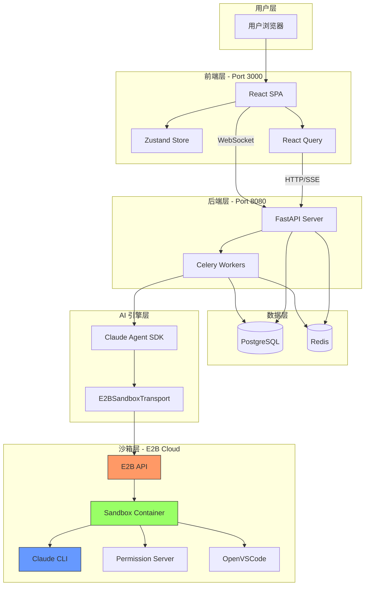

### 1.2 关键组件职责矩阵

| 组件 | 职责 | 依赖 | 被依赖 |
|------|------|------|--------|
| **FastAPI** | HTTP 请求处理、认证、路由 | PostgreSQL, Redis | 用户请求 |
| **Celery** | 异步任务执行、长时运算 | Redis, PostgreSQL | FastAPI |
| **ClaudeAgentService** | AI 交互编排、流处理 | SandboxService, SDK | Celery Task |
| **SandboxService** | 沙箱生命周期管理 | E2B API | ClaudeAgentService |
| **E2BSandboxTransport** | SDK ↔ E2B 桥接 | E2B Sandbox | Claude SDK |
| **Claude CLI** | AI 推理、工具调用 | MCP Servers | Transport |
| **Permission Server** | 权限审批代理 | Backend API | Claude CLI |

---

## 2. Backend 与 E2B 交互深度解析

### 2.1 交互时序图

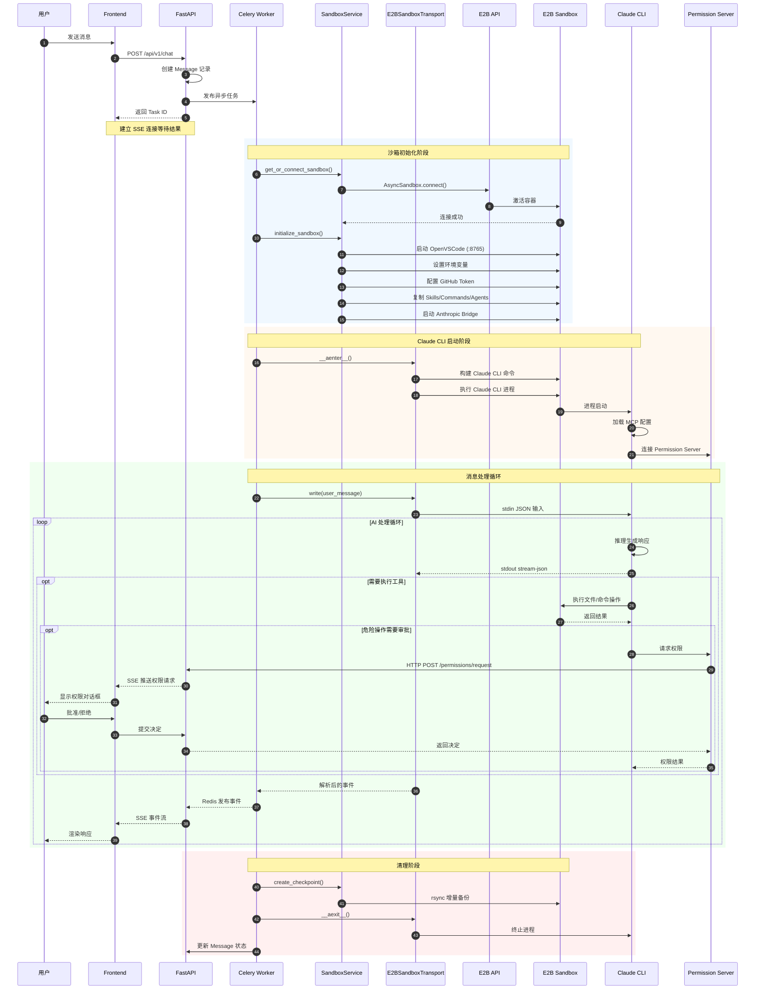

### 2.2 E2B 沙箱内部架构

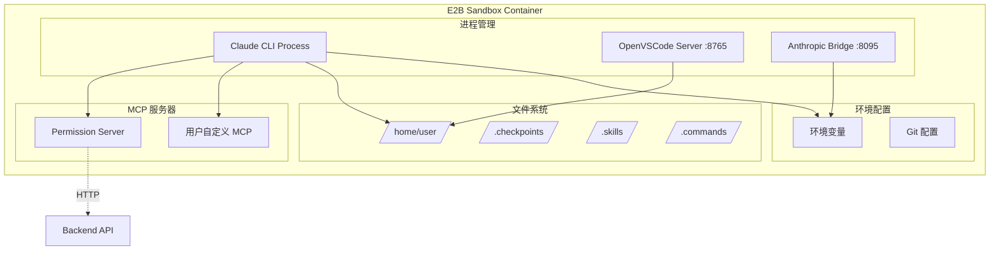

### 2.3 数据流详解

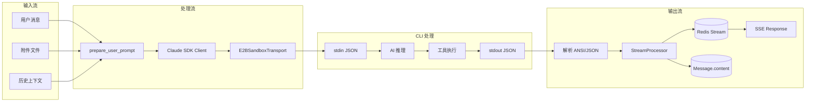

### 2.4 Transport 层实现细节

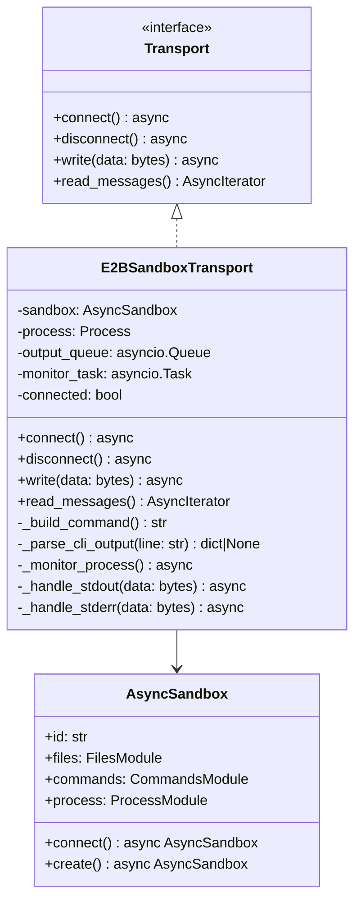

**关键实现点**:

```python
# 1. 命令构建
def _build_command(self) -> str:
    return " ".join([
        "claude",
        "--output-format", "stream-json",
        "--verbose",
        "--append-system-prompt", quote(self.system_prompt),
        "--permission-mode", self.permission_mode,
        "--model", self.model_id,
        "--mcp-config", quote(json.dumps(self.mcp_config)),
        "--input-format", "stream-json",
        *(["--resume", self.session_id] if self.session_id else []),
    ])

# 2. 输出解析
def _parse_cli_output(self, line: str) -> dict | None:
    # 去除 ANSI 转义码
    clean_line = ANSI_ESCAPE_PATTERN.sub("", line).strip()
    if not clean_line:
        return None
    try:
        return json.loads(clean_line)
    except json.JSONDecodeError:
        logger.debug(f"Non-JSON line: {clean_line}")
        return None

# 3. 异步消息读取
async def read_messages(self) -> AsyncIterator[dict]:
    while self.connected:
        try:
            message = await asyncio.wait_for(
                self.output_queue.get(),
                timeout=0.1
            )
            yield message
        except asyncio.TimeoutError:
            if not self.connected:
                break
```

---

## 3. 架构设计问题分析

### 3.1 问题一：紧耦合的服务依赖

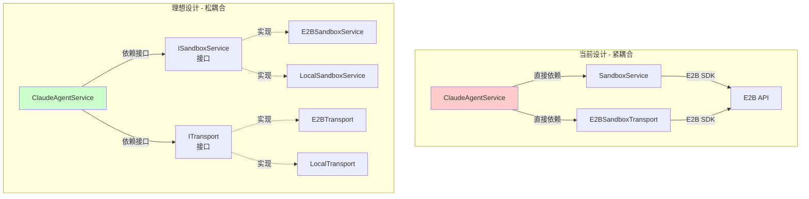

**问题**:
- `ClaudeAgentService` 直接依赖具体的 `SandboxService` 和 `E2BSandboxTransport`
- 无法轻松切换到其他沙箱提供商（如 Fly.io, Modal）
- 单元测试需要 mock 大量具体实现

**影响**:
- 供应商锁定风险
- 测试复杂度高
- 扩展困难

### 3.2 问题二：同步阻塞的权限审批

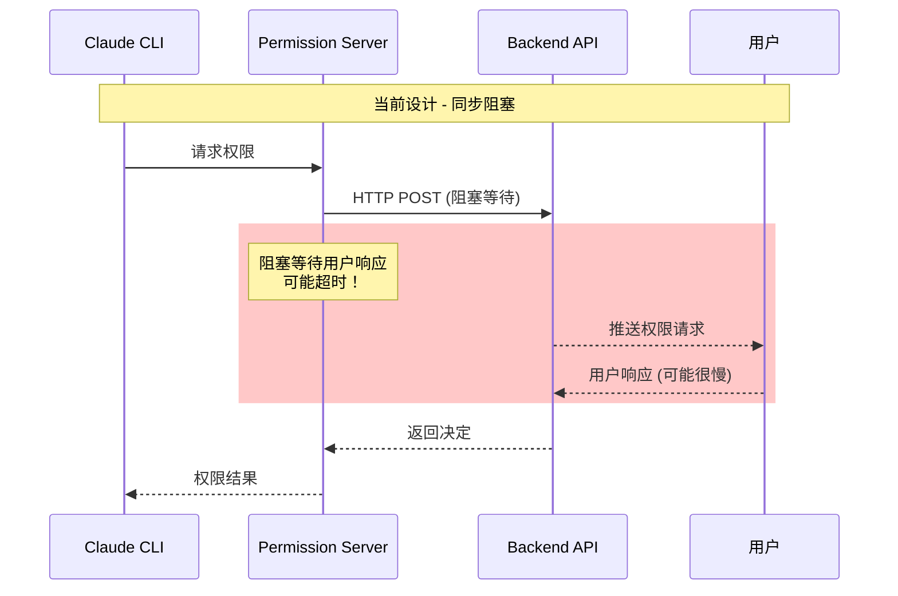

**问题**:
- Permission Server 使用同步 HTTP 请求等待用户决定
- 用户可能需要很长时间才能响应
- 长时间等待可能导致连接超时

**影响**:
- 用户体验差（必须快速响应）
- 系统可靠性降低
- 可能导致整个会话失败

### 3.3 问题三：单点故障风险

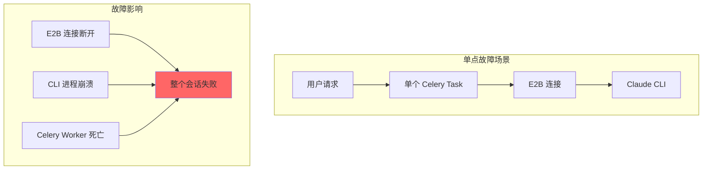

**问题**:
- 一个 Celery Task 处理整个会话
- E2B 连接断开无自动重连
- Claude CLI 崩溃无恢复机制

**影响**:
- 长时间会话容易中断
- 用户需要重新开始
- 资源浪费

### 3.4 问题四：检查点恢复的局限性

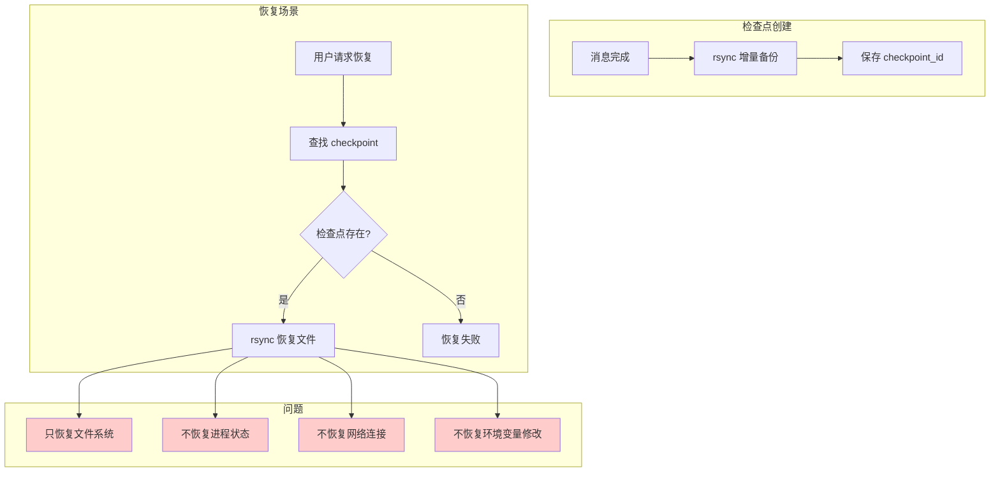

**问题**:
- 检查点只包含文件系统快照
- 无法恢复运行中的进程状态
- 无法恢复动态环境变量修改

**影响**:
- 恢复后状态不完整
- 某些操作无法继续

### 3.5 问题五：资源清理的竞态条件

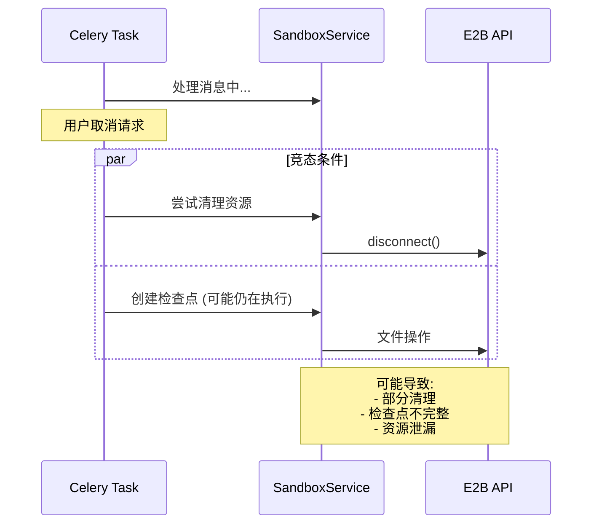

**问题**:
- 取消操作和清理操作可能同时进行
- 没有明确的资源锁定机制
- 检查点创建可能在不一致状态下执行

### 3.6 问题六：日志和可观测性不足

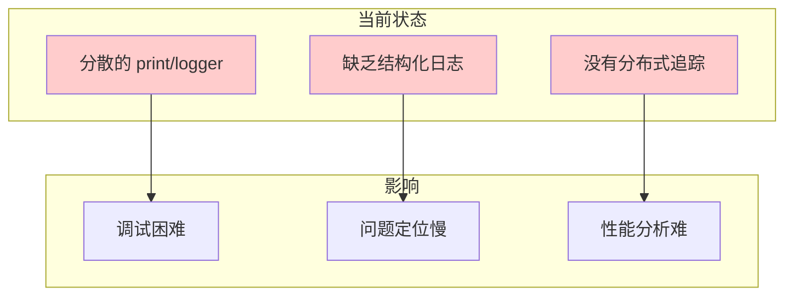

**问题**:
- 缺乏统一的日志格式
- 没有请求级别的追踪 ID
- 难以关联跨服务的日志

---

## 4. 优化建议

### 4.1 引入接口抽象层

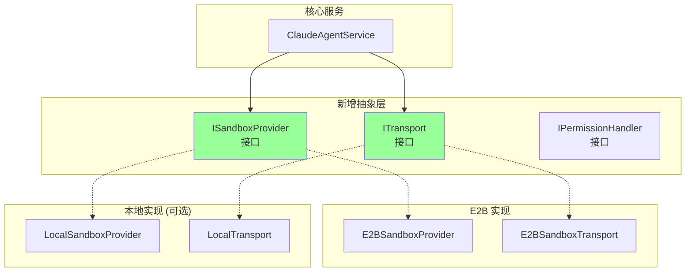

### 4.2 异步权限审批

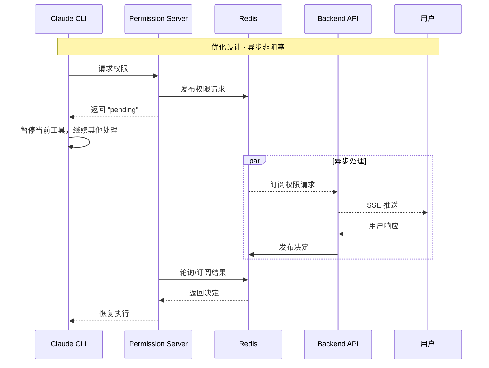

### 4.3 会话弹性机制

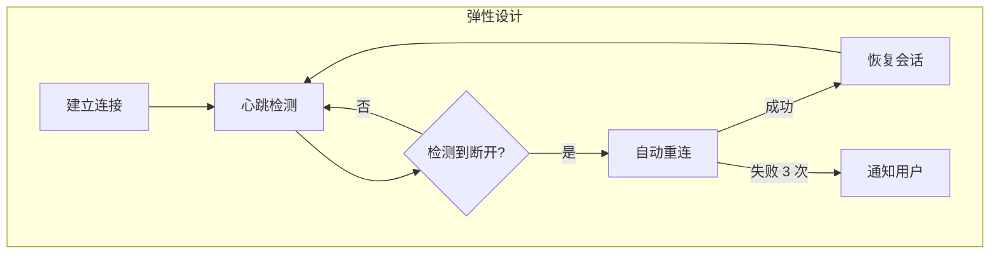

### 4.4 完整状态检查点

```python
# 建议的检查点结构
class FullCheckpoint:
    file_system: FileSystemSnapshot    # 文件系统快照
    environment: Dict[str, str]        # 环境变量
    session_state: SessionState        # Claude 会话状态
    process_state: Optional[ProcessState]  # 进程状态（如果可行）
    timestamp: datetime
    message_id: str

    async def restore(self, sandbox: Sandbox):
        await self._restore_files(sandbox)
        await self._restore_environment(sandbox)
        # Claude --resume 处理会话恢复
```

### 4.5 结构化日志和追踪

```python
# 建议的日志结构
@dataclass
class RequestContext:
    trace_id: str
    user_id: str
    chat_id: str
    message_id: str

def log_event(ctx: RequestContext, event: str, data: dict):
    logger.info(json.dumps({
        "trace_id": ctx.trace_id,
        "user_id": ctx.user_id,
        "chat_id": ctx.chat_id,
        "message_id": ctx.message_id,
        "event": event,
        "data": data,
        "timestamp": datetime.utcnow().isoformat()
    }))
```

### 4.6 优先级排序

| 优先级 | 问题 | 优化建议 | 影响 |
|--------|------|----------|------|
| **P0** | 权限审批阻塞 | 异步权限机制 | 用户体验 |
| **P0** | 单点故障 | 会话弹性机制 | 可靠性 |
| **P1** | 紧耦合 | 接口抽象层 | 可维护性 |
| **P1** | 日志不足 | 结构化日志 | 可观测性 |
| **P2** | 检查点局限 | 完整状态检查点 | 恢复能力 |
| **P2** | 竞态条件 | 资源锁定机制 | 数据一致性 |

---

## 总结

本系统采用了现代化的微服务架构，将 AI 能力（Claude）、安全执行（E2B 沙箱）和用户界面有机结合。核心设计亮点包括：

1. **分层清晰**: API → Service → Infrastructure 三层分明
2. **异步优先**: 全栈异步处理，Celery 后台任务
3. **实时通信**: SSE + WebSocket 支持流式响应
4. **安全隔离**: E2B 沙箱提供完全隔离的执行环境

但同时也存在需要改进的地方：

1. **供应商耦合**: 需要抽象层支持多沙箱提供商
2. **容错能力**: 需要更强的会话恢复和重连机制
3. **可观测性**: 需要统一的日志和追踪系统

通过实施上述优化建议，可以显著提升系统的可靠性、可维护性和用户体验。
