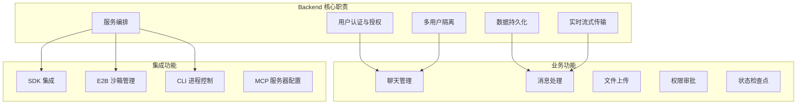
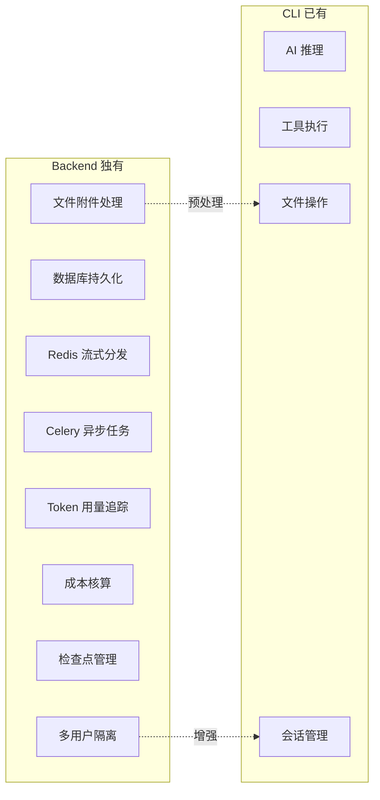
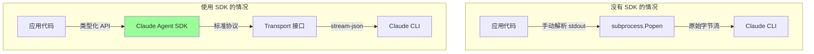
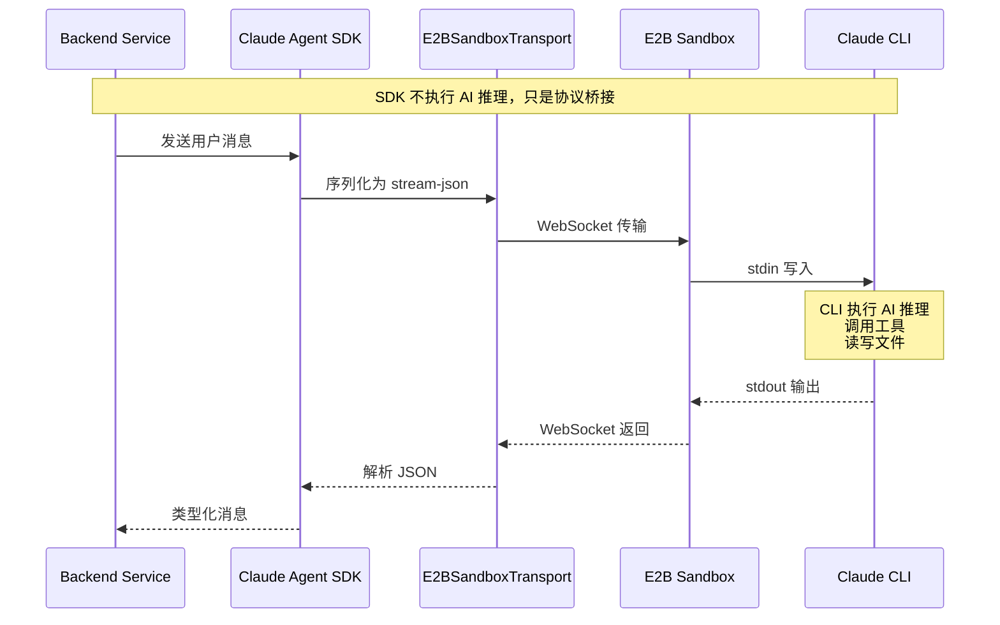
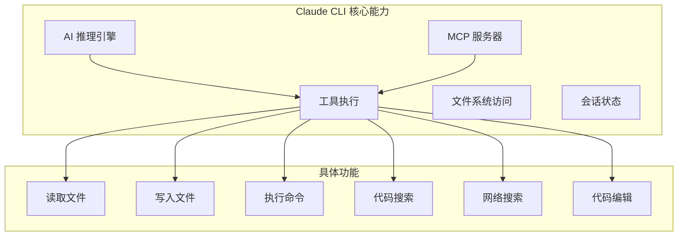
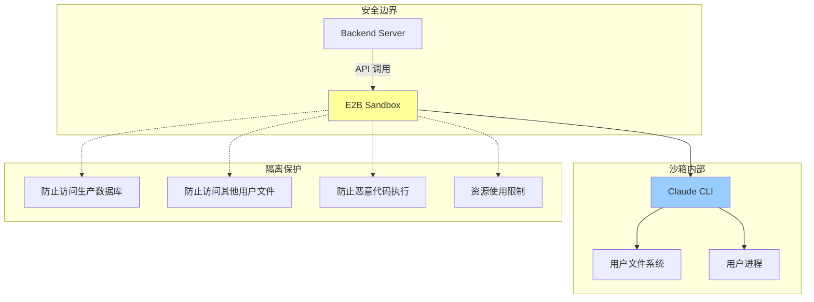
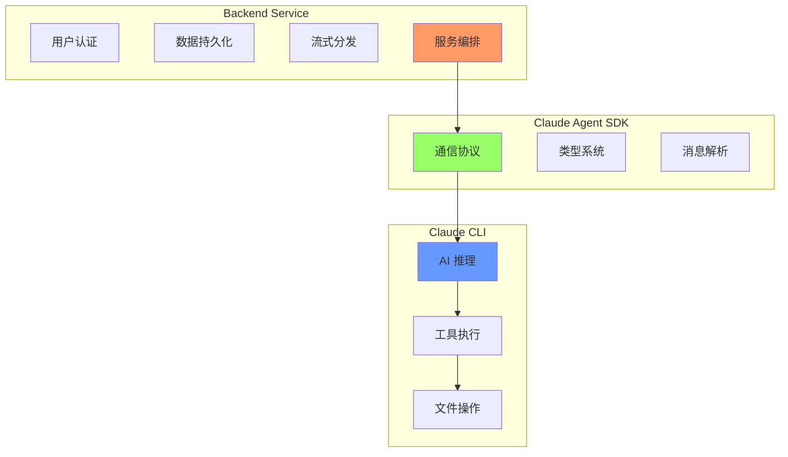
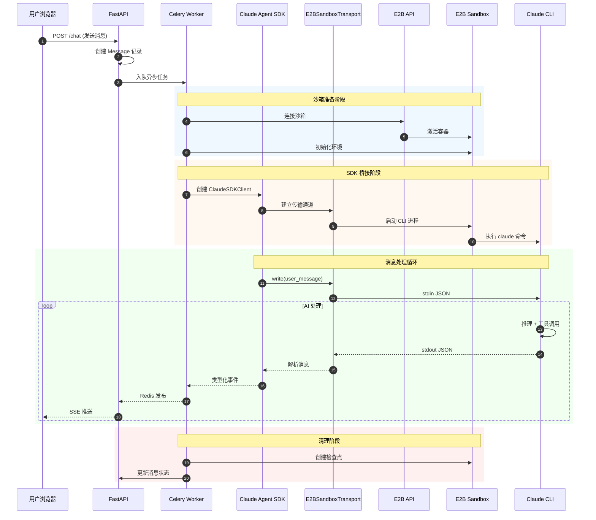

# Backend 服务架构详解

## 1. 概述

Backend 服务是整个系统的核心编排层，负责将单用户的 Claude CLI 工具转变为多用户的 Web 应用服务。它不直接执行 AI 推理，而是协调 Claude Agent SDK、E2B 沙箱和 Claude CLI 之间的交互。

## 2. Backend 主要承载的功能

### 2.1 功能全景图



### 2.2 功能分类详解

| 功能类别 | 具体功能 | 说明 |
|----------|----------|------|
| **用户管理** | 认证、授权、会话 | JWT Token、OAuth 集成 |
| **聊天管理** | 创建、列表、删除、归档 | 多用户聊天隔离 |
| **消息处理** | 发送、接收、流式输出 | SSE 实时推送 |
| **沙箱管理** | 创建、连接、销毁 | E2B 沙箱生命周期 |
| **文件处理** | 上传、同步、下载 | 沙箱内文件操作 |
| **权限控制** | 工具审批、危险操作确认 | Permission Server |
| **状态管理** | 检查点、恢复、会话续传 | 增量备份 |
| **配置管理** | 环境变量、MCP、模型选择 | 用户自定义配置 |

### 2.3 Backend 独有能力（CLI 不具备）



## 3. 为什么需要 Claude Agent SDK

### 3.1 SDK 的角色

Claude Agent SDK 是 Anthropic 官方提供的 Python 库，用于与 Claude CLI 进行程序化交互。



### 3.2 SDK 提供的核心能力

```python
# SDK 提供的类型化接口
from claude_agent_sdk import (
    ClaudeAgentOptions,    # 配置对象，30+ 参数
    ClaudeSDKClient,       # 异步客户端
    ResultMessage,         # 响应消息类型
    UserMessage,           # 用户消息类型
    TextBlock,             # 文本内容块
    ToolUseBlock,          # 工具调用块
    ThinkingBlock,         # 扩展思考块
)
```

### 3.3 SDK vs 直接调用 CLI

| 方面 | 使用 SDK | 直接调用 CLI |
|------|----------|--------------|
| **类型安全** | 完整的类型定义 | 需要手动解析 JSON |
| **错误处理** | 结构化异常 | 需要解析 stderr |
| **协议兼容** | 自动适配版本 | 需要跟踪协议变化 |
| **消息解析** | 自动解析内容块 | 手动解析 JSON 结构 |
| **会话管理** | 内置 resume 支持 | 需要手动管理 |
| **维护成本** | 低（官方维护） | 高（自行维护） |

### 3.4 SDK 在项目中的使用

```python
# 实际使用示例 - claude_agent.py
async def get_ai_stream(self, ...):
    options = ClaudeAgentOptions(
        system_prompt={"type": "preset", "preset": "claude_code"},
        permission_mode="auto",
        model="claude-opus-4-5",
        mcp_servers=mcp_config,
        resume=session_id,
    )

    async with ClaudeSDKClient(transport, options) as client:
        async for message in client.receive_response():
            # message 是类型化的 ResultMessage
            for block in message.content:
                if isinstance(block, TextBlock):
                    yield text_event(block.text)
                elif isinstance(block, ToolUseBlock):
                    yield tool_started_event(block)
```

## 4. 为什么还需要 Claude CLI

### 4.1 CLI 的角色

Claude CLI 是实际执行 AI 推理和工具调用的二进制程序。SDK 只是与它通信的协议层，真正的"大脑"是 CLI。



### 4.2 CLI 独有能力



### 4.3 为什么 CLI 必须在沙箱中运行



**安全原因**：
- CLI 可以执行任意代码（用户请求的）
- CLI 可以读写文件系统
- CLI 可以运行 shell 命令
- 必须在隔离环境中运行，防止影响生产系统

## 5. SDK + CLI + Backend 三者关系

### 5.1 职责分工



### 5.2 完整交互时序



### 5.3 三者缺一不可的原因

| 组件 | 如果缺少会怎样 |
|------|----------------|
| **Backend** | 无法多用户、无法持久化、无法 Web 访问 |
| **SDK** | 需要手动实现协议、缺乏类型安全、维护成本高 |
| **CLI** | 无法执行 AI 推理、无法调用工具、无法操作文件 |

## 6. 技术实现细节

### 6.1 Transport 桥接实现

```python
# E2BSandboxTransport 实现 SDK 的 Transport 接口
class E2BSandboxTransport(Transport):
    async def connect(self) -> None:
        # 1. 连接 E2B 沙箱
        self._sandbox = await AsyncSandbox.connect(sandbox_id)

        # 2. 构建 CLI 命令
        command = self._build_command()
        # 例如: claude --output-format stream-json --model claude-opus-4-5 ...

        # 3. 启动 CLI 进程
        self._process = await self._sandbox.commands.run(
            command,
            envs={"ANTHROPIC_API_KEY": api_key, ...},
            on_stdout=self._handle_stdout,
            on_stderr=self._handle_stderr,
        )

    async def write(self, data: str) -> None:
        # 向 CLI stdin 写入 JSON
        await self._sandbox.commands.send_stdin(self._process.pid, data)

    async def read_messages(self) -> AsyncIterator[dict]:
        # 从 stdout 读取并解析 JSON
        while self._connected:
            line = await self._output_queue.get()
            parsed = self._parse_cli_output(line)
            if parsed:
                yield parsed
```

### 6.2 CLI 命令构建

```python
def _build_command(self) -> str:
    cmd = ["claude", "--output-format", "stream-json", "--verbose"]

    # 模型选择
    if self._options.model:
        cmd.extend(["--model", self._options.model])

    # 权限模式
    if self._options.permission_mode:
        cmd.extend(["--permission-mode", self._options.permission_mode])

    # 系统提示
    if self._options.system_prompt:
        cmd.extend(["--append-system-prompt", system_prompt])

    # MCP 服务器配置
    if self._options.mcp_servers:
        mcp_config = json.dumps({"mcpServers": self._options.mcp_servers})
        cmd.extend(["--mcp-config", mcp_config])

    # 会话恢复
    if self._options.resume:
        cmd.extend(["--resume", self._options.resume])

    # 流式输入模式
    cmd.extend(["--input-format", "stream-json"])

    return shlex.join(cmd)
```

### 6.3 消息处理流程

```python
async def process_stream(self):
    async with ClaudeSDKClient(transport, options) as client:
        # SDK 返回类型化的消息
        async for message in client.receive_response():
            for block in message.content:
                # 根据 block 类型处理
                if isinstance(block, TextBlock):
                    event = {"type": "assistant_text", "text": block.text}
                elif isinstance(block, ToolUseBlock):
                    event = {"type": "tool_started", "tool": {...}}
                elif isinstance(block, ThinkingBlock):
                    event = {"type": "assistant_thinking", "thinking": block.thinking}

                # 发布到 Redis
                await redis.xadd(f"chat:{chat_id}", event)

                # 保存到数据库
                events.append(event)

        # 保存最终消息
        message.content = json.dumps(events)
        await session.commit()
```

## 7. 总结

### 7.1 架构总览

```
┌─────────────────────────────────────────────────────────────────┐
│                        Backend Service                          │
│  ┌──────────────────────────────────────────────────────────┐  │
│  │  • 用户认证与授权                                          │  │
│  │  • 多用户隔离与会话管理                                     │  │
│  │  • 数据持久化 (PostgreSQL)                                 │  │
│  │  • 实时流式分发 (Redis + SSE)                              │  │
│  │  • 异步任务处理 (Celery)                                   │  │
│  └──────────────────────────────────────────────────────────┘  │
│                              ↓                                  │
│  ┌──────────────────────────────────────────────────────────┐  │
│  │               Claude Agent SDK (协议层)                     │  │
│  │  • 类型化 API 接口                                         │  │
│  │  • 消息序列化/反序列化                                      │  │
│  │  • Transport 抽象                                          │  │
│  └──────────────────────────────────────────────────────────┘  │
│                              ↓                                  │
│  ┌──────────────────────────────────────────────────────────┐  │
│  │            E2BSandboxTransport (桥接层)                     │  │
│  │  • 沙箱连接管理                                            │  │
│  │  • CLI 进程控制                                            │  │
│  │  • stdin/stdout 桥接                                       │  │
│  └──────────────────────────────────────────────────────────┘  │
└─────────────────────────────────────────────────────────────────┘
                              ↓
┌─────────────────────────────────────────────────────────────────┐
│                         E2B Sandbox                             │
│  ┌──────────────────────────────────────────────────────────┐  │
│  │               Claude CLI (执行层)                          │  │
│  │  • AI 推理引擎                                             │  │
│  │  • 工具执行 (文件、命令、搜索)                              │  │
│  │  • MCP 服务器                                              │  │
│  │  • 会话状态管理                                            │  │
│  └──────────────────────────────────────────────────────────┘  │
└─────────────────────────────────────────────────────────────────┘
```

### 7.2 关键结论

1. **Backend Service** = 多用户 Web 应用层（持久化、认证、流式传输）
2. **Claude Agent SDK** = 协议抽象层（类型安全、版本兼容）
3. **Claude CLI** = AI 执行层（推理、工具、文件操作）
4. **E2B Sandbox** = 安全隔离层（保护生产环境）

四者协同工作，将单用户命令行工具转变为安全、可扩展的多用户 Web 服务。
