# Claude Agent 架构深度解析

## 1. 概述

Claude Agent 是本系统的核心 AI 引擎，负责处理用户请求、调用工具、执行代码并生成响应。它基于 Claude Agent SDK 构建，通过 E2B 沙箱环境实现安全的代码执行。

## 2. 核心组件

### 2.1 组件关系图

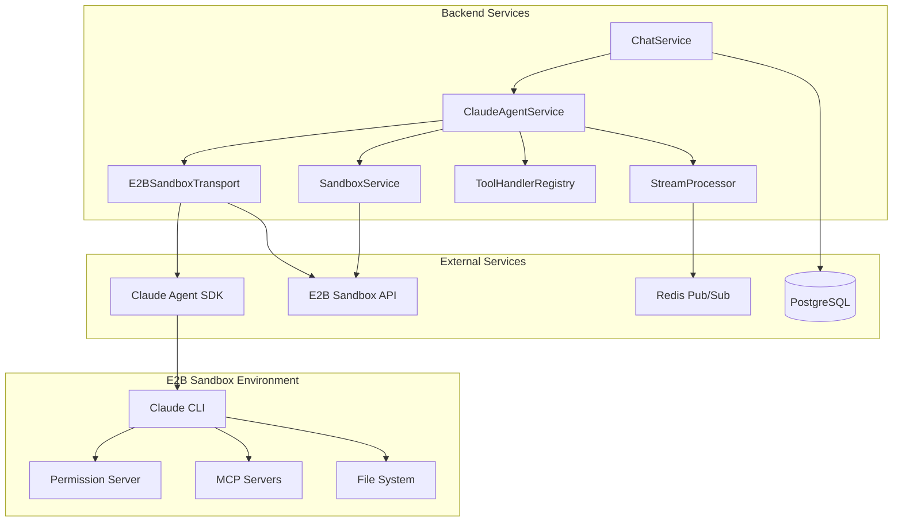

### 2.2 核心服务职责

| 服务 | 文件位置 | 核心职责 |
|------|----------|----------|
| **ClaudeAgentService** | `services/claude_agent.py` | 编排 Claude SDK 与 E2B 沙箱的交互 |
| **SandboxService** | `services/sandbox.py` | 管理 E2B 沙箱生命周期和操作 |
| **E2BSandboxTransport** | `services/e2b_transport.py` | 实现 Transport 接口，桥接 Claude SDK 与 E2B |
| **ChatService** | `services/chat.py` | 高层聊天操作，消息管理 |
| **ToolHandlerRegistry** | `services/tool_handler.py` | 追踪和管理工具执行状态 |
| **StreamProcessor** | `services/streaming/processor.py` | 处理流式事件，发布到 Redis |

## 3. Claude Agent SDK 集成

### 3.1 SDK 配置构建流程

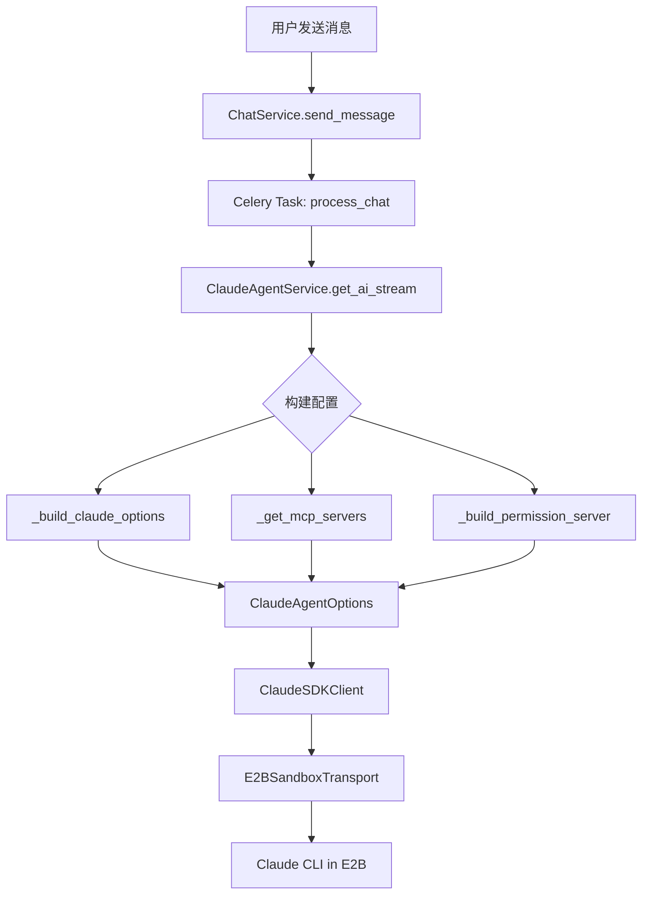

### 3.2 ClaudeAgentOptions 配置详解

```python
ClaudeAgentOptions(
    system_prompt={
        "type": "preset",
        "preset": "claude_code",      # 使用 Claude Code 预设
        "append": custom_system_prompt # 追加自定义系统提示
    },
    permission_mode="auto",            # plan/ask/auto/bypassPermissions
    model="claude-opus-4-5",           # AI 模型选择
    mcp_servers={...},                 # MCP 服务器配置
    cwd="/home/user",                  # 工作目录
    user="user",                       # 沙箱用户
    resume=session_id,                 # 会话恢复 ID
    env={...},                         # 环境变量
    max_thinking_tokens=thinking_mode, # 扩展思考预算
)
```

### 3.3 Transport 接口与 E2BSandboxTransport

#### 3.3.1 Transport 抽象接口

`Transport` 是 Claude Agent SDK 提供的**抽象基类**，定义了与 Claude CLI 通信的标准协议：

```python
# Claude Agent SDK 定义的接口
from claude_agent_sdk._internal.transport import Transport

class Transport(ABC):
    async def connect(self) -> None: ...      # 建立连接
    async def close(self) -> None: ...        # 关闭连接
    async def write(self, data: str) -> None: ... # 写入数据到 CLI stdin
    def read_messages(self) -> AsyncIterator[dict]: ... # 读取 CLI stdout
    async def end_input(self) -> None: ...    # 发送 EOF 信号
    def is_ready(self) -> bool: ...           # 检查连接状态
```

#### 3.3.2 E2BSandboxTransport 实现

`E2BSandboxTransport` 是**本项目自定义实现**的 Transport，用于适配 E2B 云沙箱环境：

```python
# services/e2b_transport.py
from claude_agent_sdk._internal.transport import Transport

class E2BSandboxTransport(Transport):
    """将 Transport 接口适配到 E2B 沙箱环境"""

    async def connect(self) -> None:
        # 1. 连接 E2B 沙箱
        self._sandbox = await AsyncSandbox.connect(sandbox_id, api_key)

        # 2. 构建 Claude CLI 命令
        command = self._build_command()

        # 3. 在沙箱中启动 CLI 进程
        self._command = await self._sandbox.commands.run(command, ...)

    async def write(self, data: str) -> None:
        # 向 CLI stdin 写入 JSON
        await self._sandbox.commands.send_stdin(self._command.pid, data)

    def read_messages(self) -> AsyncIterator[dict]:
        # 从 stdout 读取并解析 JSON（去除 ANSI 转义码）
        return self._parse_cli_output()
```

#### 3.3.3 架构设计意图

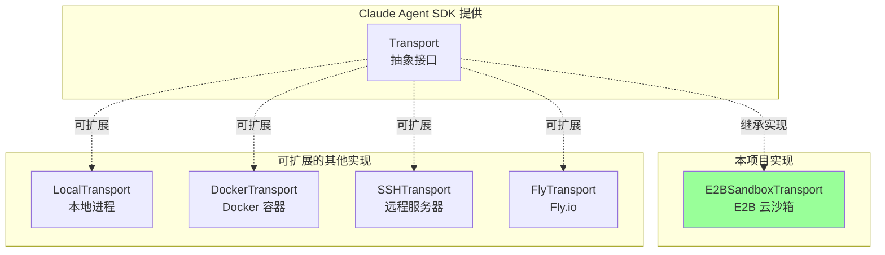

**设计优势**：

| 层级 | 提供者 | 职责 |
|------|--------|------|
| **Transport 接口** | Claude Agent SDK | 定义通信协议规范 |
| **E2BSandboxTransport** | 本项目 | 适配 E2B 沙箱环境 |

- SDK 只定义"怎么通信"，不关心"在哪里运行 CLI"
- 项目可以自由选择运行环境（E2B、Docker、本地等）
- 切换沙箱提供商只需实现新的 Transport 类

### 3.4 权限模式详解

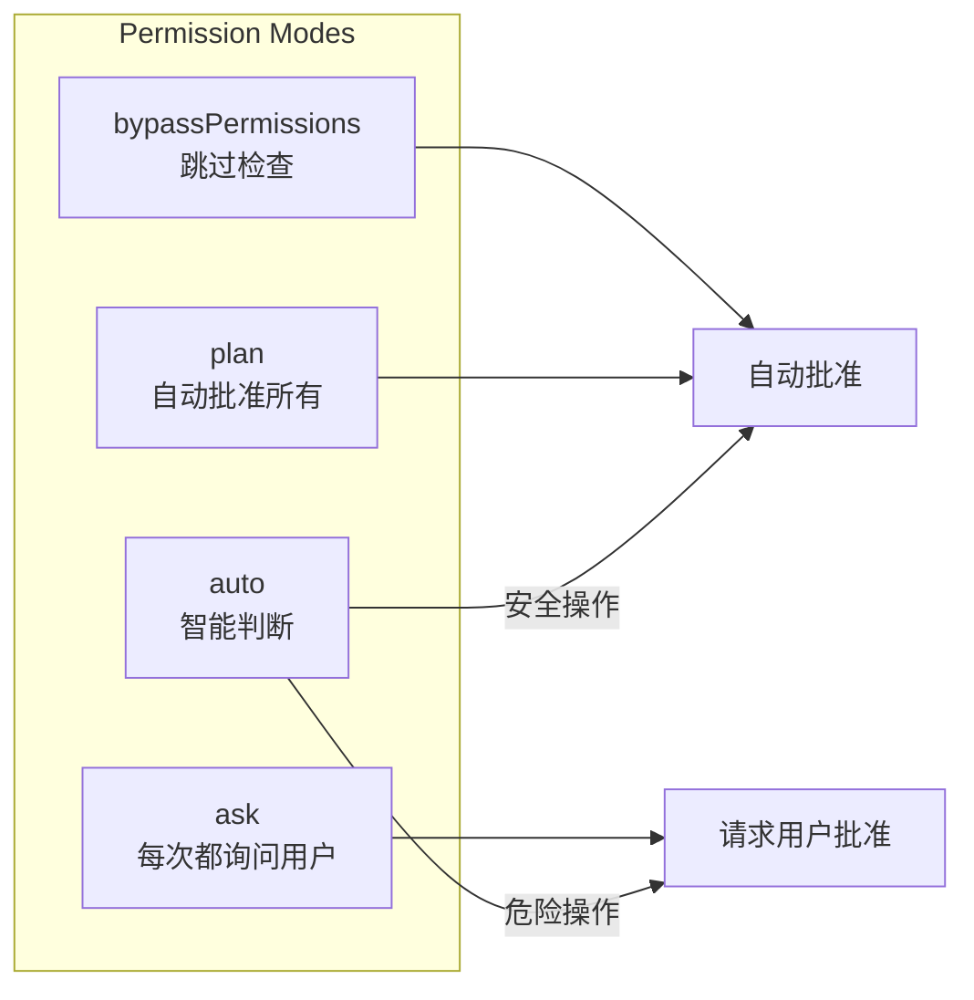

## 4. MCP 服务器架构

### 4.1 MCP 服务器类型

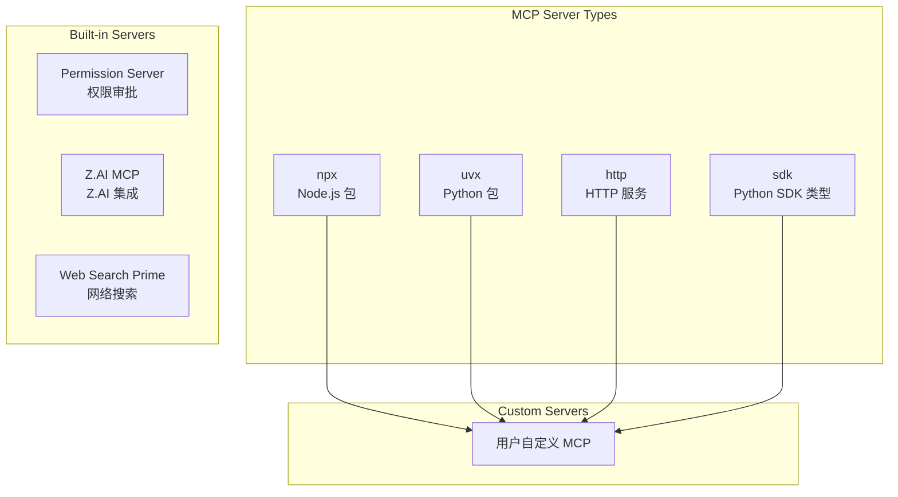

### 4.2 Permission Server 工作流程

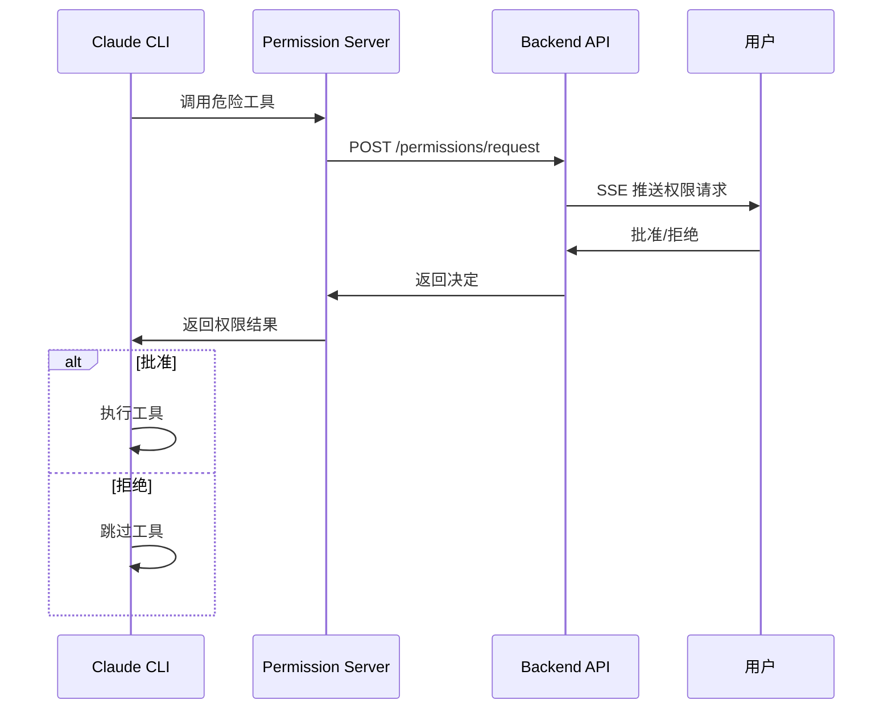

## 5. 工具处理机制

### 5.1 ToolHandlerRegistry 状态机

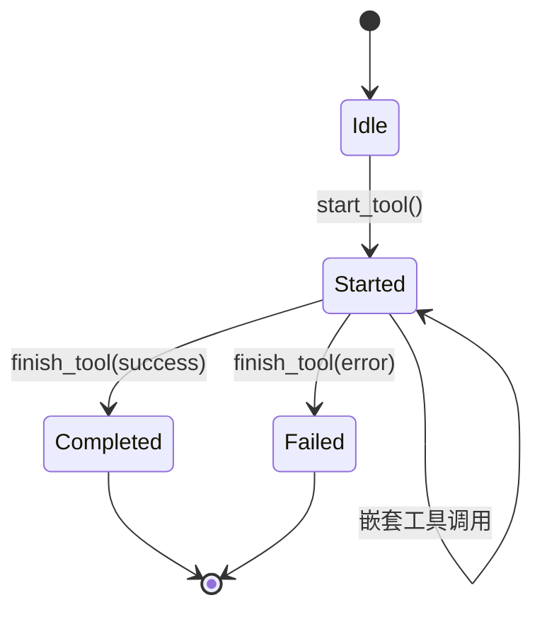

### 5.2 工具结果规范化

```python
class ToolHandlerRegistry:
    def _normalize_result(self, result) -> JSONValue:
        """
        递归解析 JSON 编码的字符串结果
        处理嵌套的数组/字典
        """
        if isinstance(result, str):
            try:
                parsed = json.loads(result)
                return self._normalize_result(parsed)
            except json.JSONDecodeError:
                return result
        # ... 递归处理嵌套结构
```

## 6. 流式处理架构

### 6.1 事件类型

```typescript
type StreamEventType =
    | "assistant_text"      // AI 文本输出
    | "assistant_thinking"  // 扩展思考内容
    | "tool_started"        // 工具开始执行
    | "tool_completed"      // 工具执行完成
    | "tool_failed"         // 工具执行失败
    | "user_text"           // 用户输入
    | "system"              // 系统消息
    | "permission_request"  // 权限请求
```

### 6.2 事件流处理管道

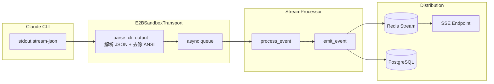

## 7. 会话管理

### 7.1 会话恢复机制

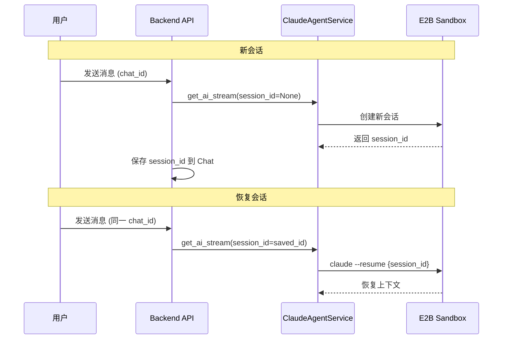

### 7.2 检查点系统

检查点使用 rsync 的 `--link-dest` 实现增量备份：

```bash
rsync -a --delete \
  --link-dest=previous_checkpoint \
  --exclude=.checkpoints \
  --exclude=.cache \
  /home/user/ \
  /home/user/.checkpoints/{message_id}/
```

**优势**:
- 只有修改的文件占用磁盘空间
- 未修改文件通过硬链接共享
- 支持快速恢复到任意消息点
- 每个沙箱最多 20 个检查点

## 8. 错误处理与重试

### 8.1 错误处理策略

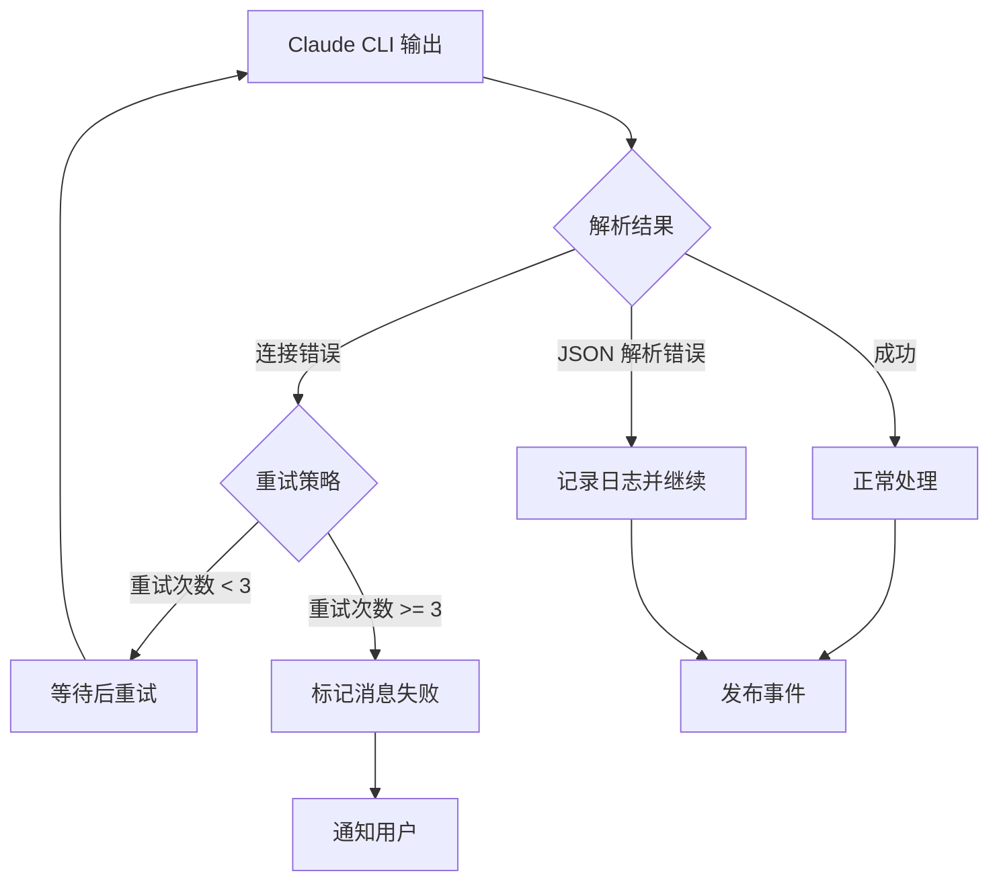

### 8.2 取消机制

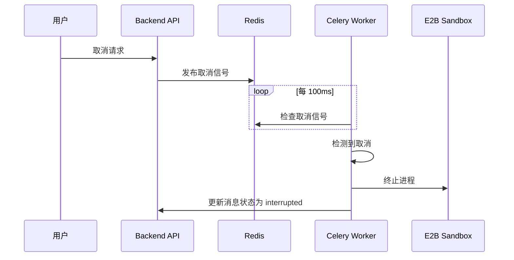

## 9. 性能优化

### 9.1 并行处理

- **流式输出**: 边生成边输出，无需等待完整响应
- **Redis Stream**: 支持 SSE 断线重连，通过 Last-Event-ID 恢复
- **双任务监控**: 主任务处理流，监控任务检查取消

### 9.2 资源管理

```python
# 异步上下文管理器确保资源清理
async with ClaudeAgentService(...) as ai_service:
    async with E2BSandboxTransport(...) as transport:
        async with ClaudeSDKClient(...) as client:
            # 所有清理自动执行
```

## 10. 扩展机制

### 10.1 自定义 Skills

用户可以创建自定义 Skills，在聊天中通过 `/skill` 命令调用：

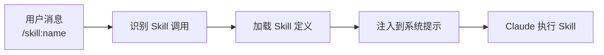

### 10.2 自定义 Commands

Slash Commands 提供快捷操作：

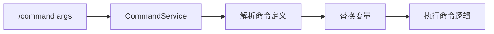

### 10.3 自定义 Agents

用户可以定义专门的 Agent 角色：


