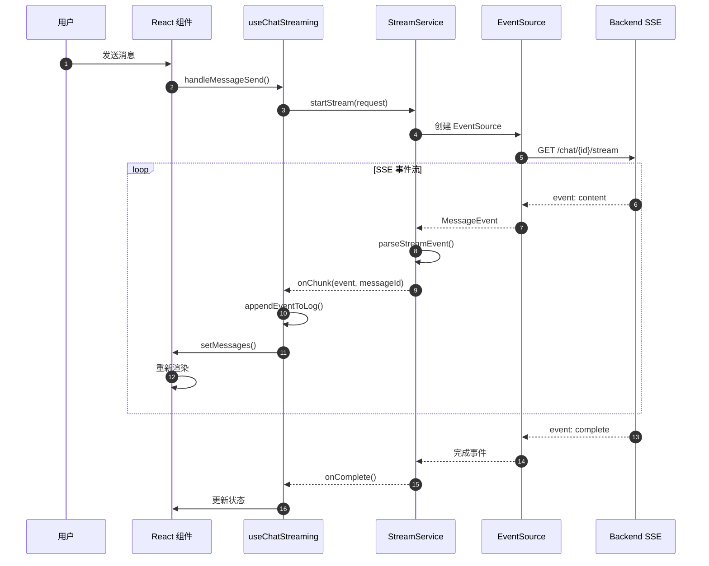
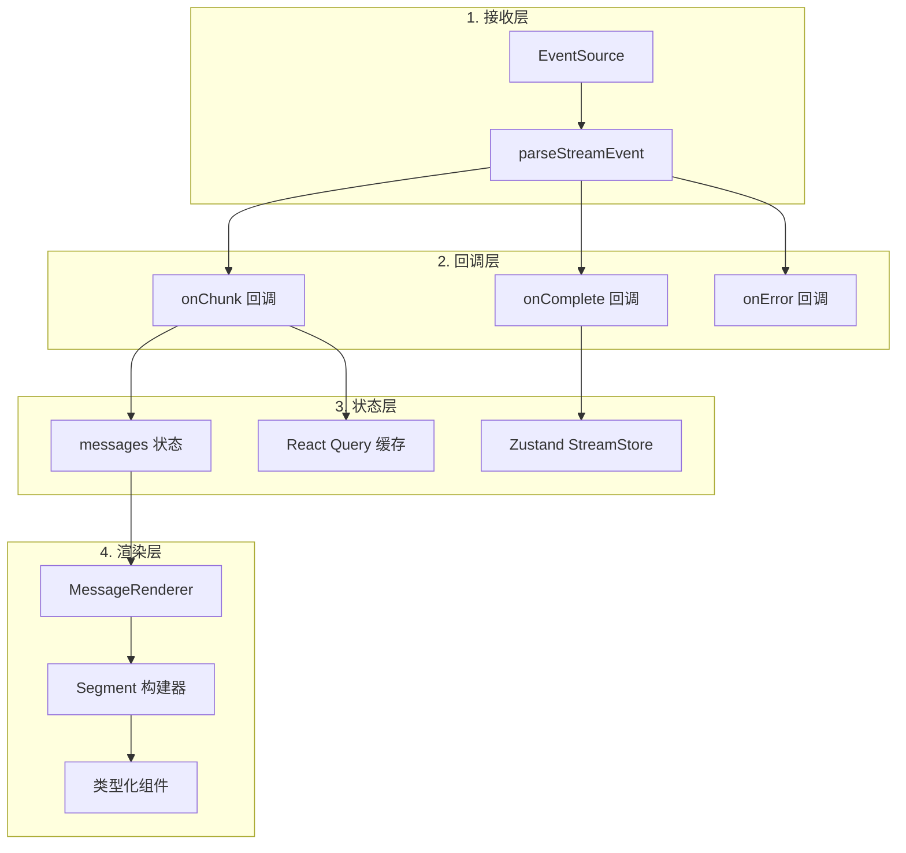
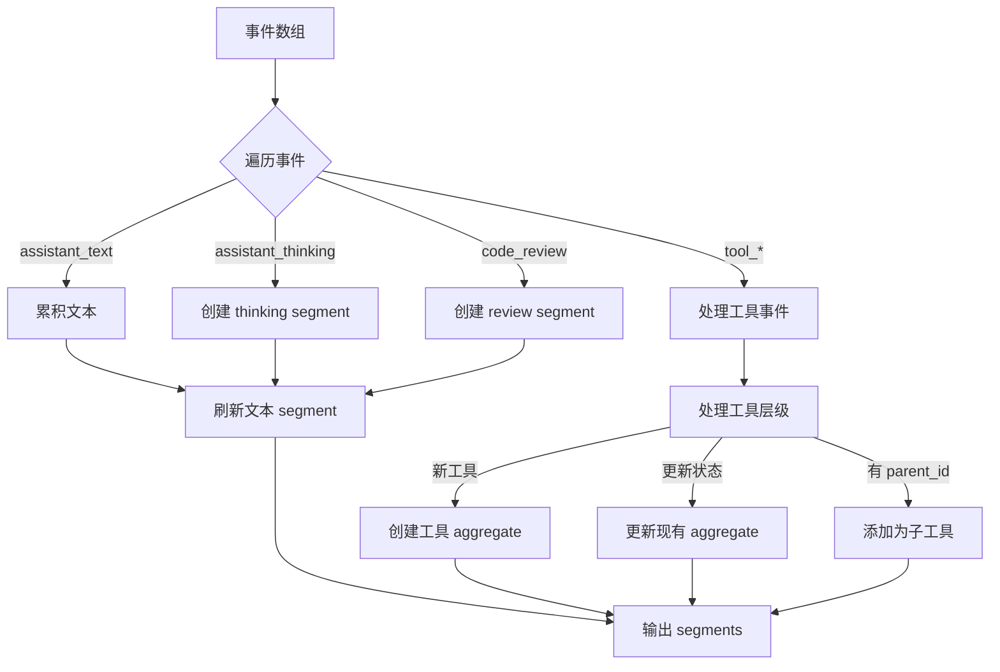
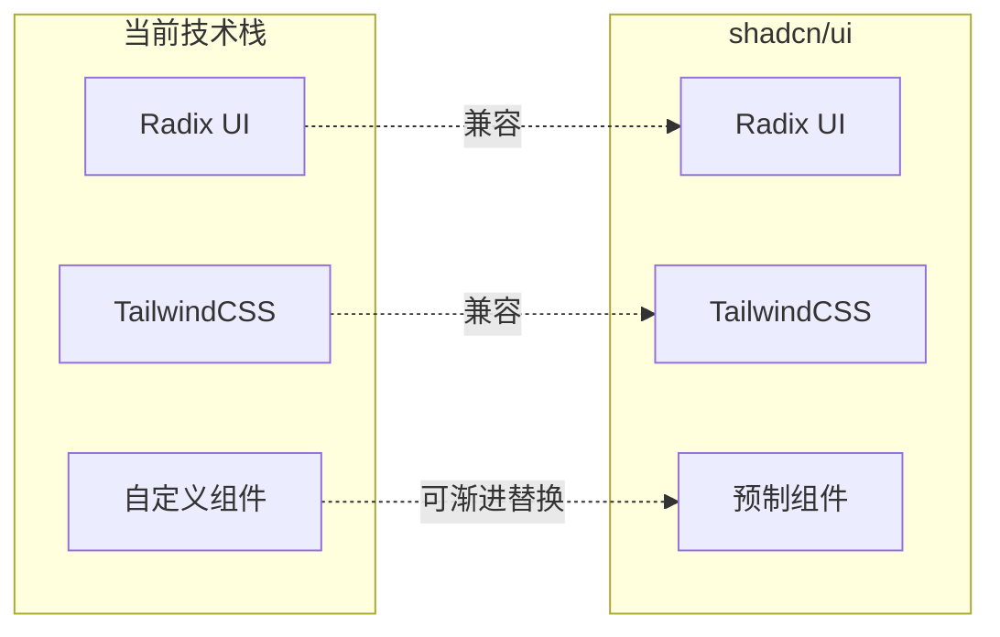
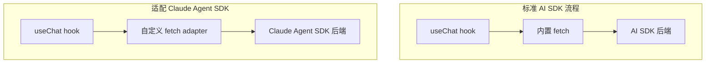
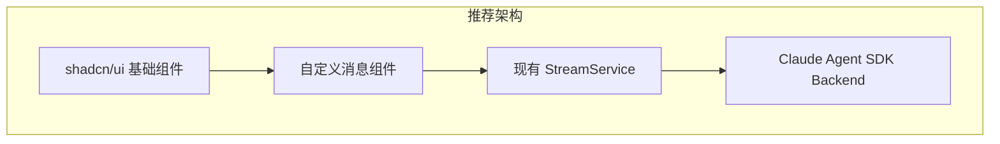
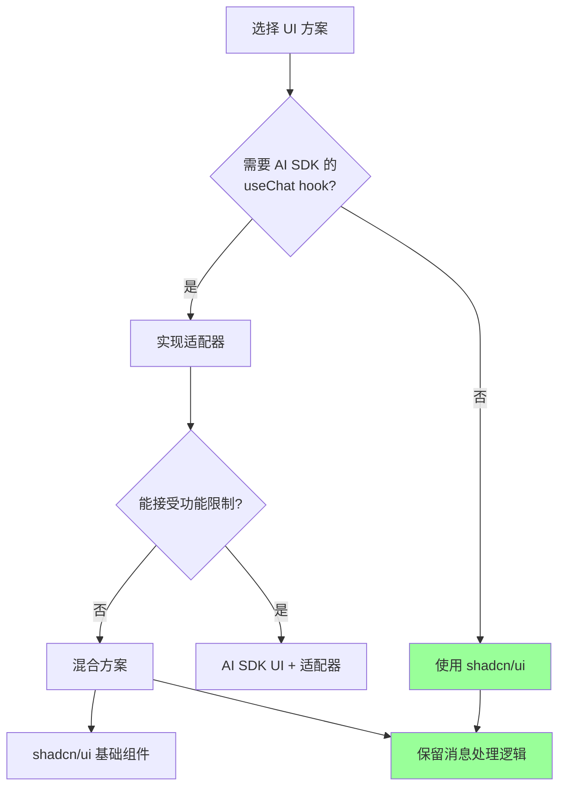

# Frontend 服务架构详解

## 1. 概述

Frontend 是基于 React 19 + TypeScript 构建的单页应用，负责与 Backend 通过 SSE（Server-Sent Events）实时通信，渲染 AI 对话、工具执行状态和扩展思考内容。

## 2. 消息处理架构

### 2.1 整体数据流



### 2.2 核心处理流程



## 3. Backend 返回的消息格式

### 3.1 SSE 事件结构

Backend 通过 SSE 发送三种事件类型：

```typescript
// 1. content 事件 - 主要消息内容
event: content
data: {"event": {...AssistantStreamEvent}}

// 2. error 事件 - 错误信息
event: error
data: {"error": "Error message"}

// 3. complete 事件 - 流结束信号
event: complete
data: {}
```

### 3.2 AssistantStreamEvent 类型定义

```typescript
// frontend/src/types/chat.types.ts
export type AssistantStreamEvent =
  // AI 文本输出
  | { type: 'assistant_text'; text: string }

  // 扩展思考内容
  | { type: 'assistant_thinking'; thinking: string }

  // 工具开始执行
  | { type: 'tool_started'; tool: ToolEventPayload }

  // 工具执行完成
  | { type: 'tool_completed'; tool: ToolEventPayload }

  // 工具执行失败
  | { type: 'tool_failed'; tool: ToolEventPayload }

  // 用户文本（回显）
  | { type: 'user_text'; text: string }

  // 代码审查
  | { type: 'code_review'; reviews: LineReview[] }

  // 系统消息（token 用量等）
  | {
      type: 'system';
      data?: {
        context_usage?: { tokens_used: number; context_window: number };
      } & Record<string, unknown>;
    }

  // 权限请求
  | {
      type: 'permission_request';
      request_id: string;
      tool_name: string;
      tool_input: Record<string, unknown>;
    };
```

### 3.3 工具事件负载

```typescript
// frontend/src/types/tools.types.ts
export interface ToolEventPayload {
  id: string;                           // 工具调用唯一 ID
  name: string;                         // 工具名称 (Write, Read, Bash, etc.)
  title: string;                        // 显示标题
  status: 'started' | 'completed' | 'failed';
  parent_id?: string | null;            // 父工具 ID（嵌套工具）
  input?: Record<string, unknown>;      // 工具输入参数
  result?: unknown;                     // 执行结果
  error?: string;                       // 错误信息
}
```

### 3.4 完整消息示例

Backend 返回的 `Message.content` 是一个 JSON 序列化的事件数组：

```json
[
  {
    "type": "assistant_thinking",
    "thinking": "用户想要创建一个排序函数，我需要考虑使用什么算法..."
  },
  {
    "type": "assistant_text",
    "text": "我来帮你实现一个快速排序算法。\n\n"
  },
  {
    "type": "tool_started",
    "tool": {
      "id": "tool_abc123",
      "name": "Write",
      "title": "Writing quicksort.py",
      "status": "started",
      "input": {
        "file_path": "/home/user/quicksort.py",
        "content": "def quicksort(arr):\n    if len(arr) <= 1:\n        return arr\n    ..."
      }
    }
  },
  {
    "type": "tool_completed",
    "tool": {
      "id": "tool_abc123",
      "name": "Write",
      "title": "Writing quicksort.py",
      "status": "completed",
      "result": "File created successfully"
    }
  },
  {
    "type": "assistant_text",
    "text": "我已经创建了 `quicksort.py` 文件，包含快速排序的实现。"
  },
  {
    "type": "system",
    "data": {
      "context_usage": {
        "tokens_used": 12500,
        "context_window": 200000
      }
    }
  }
]
```

### 3.5 嵌套工具示例

当工具有父子关系时（如 Task 工具内部调用其他工具）：

```json
[
  {
    "type": "tool_started",
    "tool": {
      "id": "task_001",
      "name": "Task",
      "title": "Searching codebase",
      "status": "started",
      "parent_id": null
    }
  },
  {
    "type": "tool_started",
    "tool": {
      "id": "grep_001",
      "name": "Grep",
      "title": "Searching for 'handleClick'",
      "status": "started",
      "parent_id": "task_001"
    }
  },
  {
    "type": "tool_completed",
    "tool": {
      "id": "grep_001",
      "name": "Grep",
      "status": "completed",
      "parent_id": "task_001",
      "result": ["src/components/Button.tsx:15", "src/pages/Home.tsx:42"]
    }
  },
  {
    "type": "tool_completed",
    "tool": {
      "id": "task_001",
      "name": "Task",
      "status": "completed",
      "result": "Found 2 occurrences of handleClick"
    }
  }
]
```

## 4. 消息类型处理

### 4.1 Segment 构建流程



### 4.2 Segment 类型

```typescript
type MessageSegment =
  | { kind: 'text'; id: string; text: string }
  | { kind: 'thinking'; id: string; text: string; eventIndex: number }
  | { kind: 'tool'; id: string; tool: ToolAggregate }
  | { kind: 'review'; id: string; reviews: LineReview[] };
```

### 4.3 渲染映射

```typescript
// MessageRenderer 核心逻辑
{segments.map((segment) => {
  switch (segment.kind) {
    case 'text':
      return <MarkDown content={segment.text} key={segment.id} />;

    case 'thinking':
      return (
        <ThinkingBlock
          content={segment.text}
          isActiveThinking={segment.eventIndex === activeThinkingIndex}
          key={segment.id}
        />
      );

    case 'tool':
      const Component = getToolComponent(segment.tool.name);
      return <Component tool={segment.tool} chatId={chatId} key={segment.id} />;

    case 'review':
      return <ReviewBlock reviews={segment.reviews} key={segment.id} />;
  }
})}
```

### 4.4 工具组件注册表

```typescript
// frontend/src/components/chat/tools/registry.tsx
export const TOOL_COMPONENTS: Record<string, ToolComponent> = {
  Task: TaskTool,           // 任务执行
  WebSearch: WebSearchTool, // 网络搜索
  TodoWrite: TodoWriteTool, // 待办管理
  Write: WriteTool,         // 文件写入
  Read: ReadTool,           // 文件读取
  Edit: EditTool,           // 文件编辑
  Bash: BashTool,           // 命令执行
  Glob: GlobTool,           // 文件搜索
  Grep: GrepTool,           // 内容搜索
  AskUserQuestion: AskUserQuestionTool,
};

// 动态获取组件
export const getToolComponent = (toolName: string): ToolComponent => {
  // 精确匹配
  if (TOOL_COMPONENTS[toolName]) {
    return TOOL_COMPONENTS[toolName];
  }

  // MCP 工具特殊处理
  if (toolName.startsWith('mcp__web-search')) {
    return WebSearchTool;
  }

  // 默认 MCP 工具组件
  return MCPTool;
};
```

## 5. 当前 UI 库分析

### 5.1 现有技术栈

| 类别 | 库 | 用途 |
|------|-----|------|
| **样式** | TailwindCSS 3.4 | 原子化 CSS |
| **基础组件** | Radix UI | 无样式可访问组件 |
| **状态管理** | Zustand 5 | 客户端状态 |
| **服务端缓存** | React Query 5 | 请求缓存 |
| **Markdown** | React Markdown 9 | Markdown 渲染 |
| **代码高亮** | Shiki 1.26 | 语法高亮 |
| **图表** | Mermaid 10 | 流程图 |
| **终端** | XTerm 5 | 终端模拟 |
| **编辑器** | Monaco 0.52 | 代码编辑器 |
| **动画** | Framer Motion 12 | 动画效果 |
| **图标** | Lucide React | 图标库 |

### 5.2 组件自定义程度

当前项目**高度自定义**，主要使用：
- Radix UI 的基础原语（Tabs, Slot）
- TailwindCSS 手写样式
- 完全自定义的消息组件

## 6. UI 库替代方案

### 6.1 方案一：使用 shadcn/ui

shadcn/ui 是基于 Radix UI + TailwindCSS 的组件集合，与当前技术栈**高度兼容**。



**优势**:
- 无需更换基础设施
- 组件源码可控（复制到项目中）
- 样式与 TailwindCSS 无缝集成
- 逐步迁移，无破坏性变更

**迁移示例**:

```bash
# 初始化 shadcn/ui
npx shadcn-ui@latest init

# 添加需要的组件
npx shadcn-ui@latest add button
npx shadcn-ui@latest add card
npx shadcn-ui@latest add dialog
npx shadcn-ui@latest add dropdown-menu
```

**替换消息气泡**:

```tsx
// 使用 shadcn Card 替代自定义消息容器
import { Card, CardContent, CardHeader } from '@/components/ui/card';

export const Message = ({ content, isBot }: MessageProps) => {
  return (
    <Card className={cn(isBot ? 'bg-muted' : 'bg-background')}>
      <CardHeader className="flex flex-row items-center gap-2 py-2">
        {isBot ? <BotAvatar /> : <UserAvatar />}
        <span>{isBot ? 'Claudex' : 'You'}</span>
      </CardHeader>
      <CardContent>
        <MessageRenderer content={content} />
      </CardContent>
    </Card>
  );
};
```

### 6.2 方案二：使用 Vercel AI SDK UI

Vercel AI SDK UI 提供了专门为 AI 聊天设计的 React 组件和 hooks。

**重要限制**: AI SDK UI 的 hooks（如 `useChat`）**默认绑定 AI SDK 后端**，但可以通过自定义 `fetch` 适配 Claude Agent SDK 后端。



#### 6.2.1 适配器实现

```typescript
// lib/claude-adapter.ts
import { Message } from 'ai';

interface ClaudeStreamEvent {
  type: string;
  text?: string;
  thinking?: string;
  tool?: Record<string, unknown>;
}

/**
 * 将 Claude Agent SDK SSE 流转换为 AI SDK 兼容格式
 */
export async function* claudeToAISDKStream(
  response: Response
): AsyncGenerator<string> {
  const reader = response.body?.getReader();
  if (!reader) throw new Error('No response body');

  const decoder = new TextDecoder();
  let buffer = '';

  while (true) {
    const { done, value } = await reader.read();
    if (done) break;

    buffer += decoder.decode(value, { stream: true });
    const lines = buffer.split('\n');
    buffer = lines.pop() || '';

    for (const line of lines) {
      if (!line.startsWith('data: ')) continue;

      const data = line.slice(6);
      if (data === '[DONE]') continue;

      try {
        const parsed = JSON.parse(data);
        const event = parsed.event as ClaudeStreamEvent;

        // 转换为 AI SDK 格式
        if (event.type === 'assistant_text') {
          // AI SDK 期望的文本格式
          yield `0:${JSON.stringify(event.text)}\n`;
        } else if (event.type === 'tool_started') {
          // 工具调用开始
          yield `9:${JSON.stringify({
            toolCallId: event.tool?.id,
            toolName: event.tool?.name,
            args: event.tool?.input,
          })}\n`;
        } else if (event.type === 'tool_completed') {
          // 工具调用结果
          yield `a:${JSON.stringify({
            toolCallId: event.tool?.id,
            result: event.tool?.result,
          })}\n`;
        }
      } catch (e) {
        console.error('Parse error:', e);
      }
    }
  }
}

/**
 * 创建适配 Claude Agent SDK 的 fetch 函数
 */
export function createClaudeFetch(baseUrl: string) {
  return async (input: RequestInfo | URL, init?: RequestInit) => {
    const url = typeof input === 'string' ? input : input.toString();

    // 如果是 AI SDK 的默认路由，重定向到 Claude 后端
    if (url.includes('/api/chat')) {
      const body = init?.body ? JSON.parse(init.body as string) : {};

      const response = await fetch(`${baseUrl}/api/v1/chat`, {
        method: 'POST',
        headers: {
          'Content-Type': 'application/json',
          'Authorization': `Bearer ${getToken()}`,
        },
        body: JSON.stringify({
          prompt: body.messages?.[body.messages.length - 1]?.content,
          chat_id: body.chatId,
          model_id: body.model || 'claude-sonnet-4-20250514',
          permission_mode: 'auto',
        }),
      });

      // 转换 SSE 流
      const transformedStream = new ReadableStream({
        async start(controller) {
          for await (const chunk of claudeToAISDKStream(response)) {
            controller.enqueue(new TextEncoder().encode(chunk));
          }
          controller.close();
        },
      });

      return new Response(transformedStream, {
        headers: { 'Content-Type': 'text/plain; charset=utf-8' },
      });
    }

    // 其他请求正常处理
    return fetch(input, init);
  };
}
```

#### 6.2.2 使用适配后的 useChat

```tsx
// components/ChatWithAISDK.tsx
import { useChat } from 'ai/react';
import { createClaudeFetch } from '@/lib/claude-adapter';

const claudeFetch = createClaudeFetch(process.env.NEXT_PUBLIC_API_URL!);

export function ChatWithAISDK() {
  const {
    messages,
    input,
    handleInputChange,
    handleSubmit,
    isLoading,
  } = useChat({
    fetch: claudeFetch,
    api: '/api/chat', // 会被 adapter 拦截
  });

  return (
    <div className="flex flex-col h-full">
      <div className="flex-1 overflow-y-auto">
        {messages.map((message) => (
          <div key={message.id}>
            <strong>{message.role}:</strong>
            {message.content}
          </div>
        ))}
      </div>

      <form onSubmit={handleSubmit}>
        <input
          value={input}
          onChange={handleInputChange}
          placeholder="Type a message..."
        />
        <button type="submit" disabled={isLoading}>
          Send
        </button>
      </form>
    </div>
  );
}
```

### 6.3 方案对比

| 方面 | shadcn/ui | AI SDK UI |
|------|-----------|-----------|
| **基础设施变更** | 无 | 需要适配器 |
| **学习曲线** | 低 | 中 |
| **适配工作量** | 低（渐进替换） | 中（需要流转换） |
| **工具渲染支持** | 需自行实现 | 部分支持 |
| **扩展思考支持** | 需自行实现 | 需自定义 |
| **类型安全** | 完全兼容 | 需要类型映射 |
| **维护成本** | 低 | 中 |

### 6.4 推荐方案

考虑到后端使用 Claude Agent SDK，推荐 **方案一（shadcn/ui）+ 保留现有消息处理逻辑**：



**理由**:
1. 保留现有的 SSE 处理逻辑（已经稳定）
2. 保留复杂的工具层级处理（AI SDK UI 不支持）
3. 保留扩展思考渲染（AI SDK UI 不支持）
4. 只替换 UI 原语，不改变数据流

## 7. 渐进迁移策略

### 7.1 第一阶段：引入 shadcn/ui 基础组件

```bash
# 安装依赖
npm install tailwindcss-animate class-variance-authority clsx tailwind-merge

# 初始化
npx shadcn-ui@latest init

# 添加基础组件
npx shadcn-ui@latest add button card input textarea avatar
```

### 7.2 第二阶段：替换通用 UI 组件

```tsx
// 替换 Button
- import { Button } from '@/components/common/Button';
+ import { Button } from '@/components/ui/button';

// 替换 Input
- import { TextArea } from '@/components/common/TextArea';
+ import { Textarea } from '@/components/ui/textarea';
```

### 7.3 第三阶段：优化消息组件

使用 shadcn 的 Card、Collapsible 等组件优化消息气泡：

```tsx
import { Card, CardContent, CardHeader } from '@/components/ui/card';
import {
  Collapsible,
  CollapsibleContent,
  CollapsibleTrigger,
} from '@/components/ui/collapsible';

// ThinkingBlock 使用 Collapsible
export const ThinkingBlock = ({ content, isActive }: Props) => {
  return (
    <Collapsible defaultOpen={isActive}>
      <Card className="border-dashed">
        <CollapsibleTrigger asChild>
          <CardHeader className="cursor-pointer">
            <Brain className="h-4 w-4" />
            <span>Thinking...</span>
          </CardHeader>
        </CollapsibleTrigger>
        <CollapsibleContent>
          <CardContent>{content}</CardContent>
        </CollapsibleContent>
      </Card>
    </Collapsible>
  );
};
```

### 7.4 保持不变的核心逻辑

以下模块**不需要更改**：

- `StreamService` - SSE 连接管理
- `useStreamCallbacks` - 事件处理回调
- `segmentBuilder` - 消息分段逻辑
- `parseEventLog` - JSON 解析
- `useMessageCache` - React Query 缓存
- 工具组件注册表

## 8. 适配性检查清单

### 8.1 使用 shadcn/ui

| 检查项 | 状态 | 说明 |
|--------|------|------|
| TailwindCSS 兼容 | ✅ | 完全兼容 |
| Radix UI 兼容 | ✅ | shadcn 基于 Radix |
| TypeScript 支持 | ✅ | 完整类型 |
| 暗色模式 | ✅ | 原生支持 |
| 动画支持 | ✅ | 配合 Framer Motion |
| 无障碍 | ✅ | Radix 提供 |

### 8.2 使用 AI SDK UI

| 检查项 | 状态 | 说明 |
|--------|------|------|
| 流格式适配 | ⚠️ | 需要转换器 |
| 工具渲染 | ⚠️ | 部分支持，需扩展 |
| 扩展思考 | ❌ | 不支持，需自定义 |
| 权限请求 | ❌ | 不支持，需自定义 |
| 嵌套工具 | ❌ | 不支持 |
| TypeScript | ✅ | 完整类型 |

### 8.3 最终建议



**最终推荐**: 使用 **shadcn/ui** 替换基础 UI 组件，**保留现有消息处理和渲染逻辑**。这样既能获得现代化的 UI 组件库，又不需要重写复杂的流处理代码。
