# 沙箱生命周期与数据同步深度分析

## 1. 当前沙箱生命周期

### 1.1 沙箱创建时机

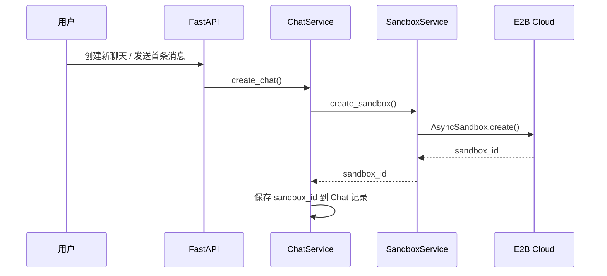
```mermaid
sequenceDiagram
    participant User as 用户
    participant API as FastAPI
    participant Chat as ChatService
    participant Sandbox as SandboxService
    participant E2B as E2B Cloud

    User->>API: 创建新聊天 / 发送首条消息
    API->>Chat: create_chat()
    Chat->>Sandbox: create_sandbox()
    Sandbox->>E2B: AsyncSandbox.create()
    E2B-->>Sandbox: sandbox_id
    Sandbox-->>Chat: sandbox_id
    Chat->>Chat: 保存 sandbox_id 到 Chat 记录
```

### 1.2 沙箱销毁时机

当前系统中，沙箱在以下情况下被销毁：

```python
# 1. 用户删除单个聊天
async def delete_chat(self, chat_id, user):
    # ... 软删除聊天和消息 ...
    if chat.sandbox_id:
        await self.sandbox_service.delete_sandbox(chat.sandbox_id)

# 2. 用户删除所有聊天
async def delete_all_chats(self, user):
    # ... 获取所有 sandbox_ids ...
    for sandbox_id in sandbox_ids:
        await self.sandbox_service.delete_sandbox(sandbox_id)

# 3. 调度任务完成后（scheduler.py）
await sandbox_service.delete_sandbox(sandbox_id)
```

### 1.3 沙箱销毁机制

```python
# sandbox.py:292-329
async def delete_sandbox(self, sandbox_id: str) -> None:
    # 异步删除，不阻塞调用方
    asyncio.create_task(self._delete_sandbox_deferred(sandbox_id))

async def _delete_sandbox_deferred(self, sandbox_id: str) -> None:
    # 1. 尝试从缓存获取沙箱
    sandbox = self._active_sandboxes.get(sandbox_id)

    # 2. 如果缓存没有，尝试重新连接
    if not sandbox:
        sandbox = await AsyncSandbox.connect(sandbox_id, api_key)

    # 3. 调用 kill() 销毁沙箱
    await sandbox.kill()

    # 4. 从缓存移除
    del self._active_sandboxes[sandbox_id]
```

### 1.4 E2B auto_pause 机制

```python
# 沙箱创建时启用自动暂停
sandbox = await AsyncSandbox.create(
    timeout=3600,           # 1 小时超时
    auto_pause=True,        # 空闲时自动暂停
)
```

**auto_pause 工作原理**：
- 沙箱空闲一段时间后自动暂停（不消耗计算资源）
- 再次连接时自动唤醒
- 暂停状态仍保留文件系统状态
- 超过最大暂停时间后才会真正销毁

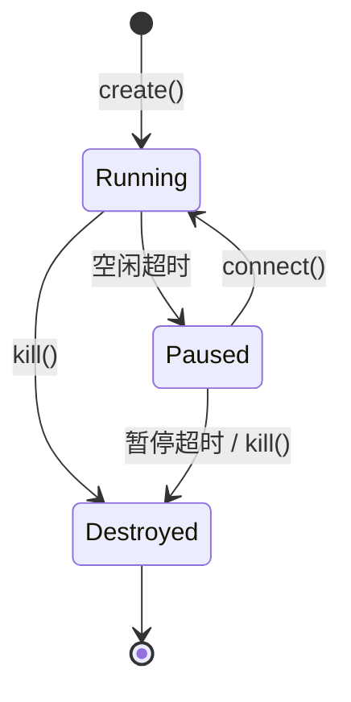
```mermaid
stateDiagram-v2
    [*] --> Running: create()
    Running --> Paused: 空闲超时
    Paused --> Running: connect()
    Running --> Destroyed: kill()
    Paused --> Destroyed: 暂停超时 / kill()
    Destroyed --> [*]
```

## 2. 当前实现问题分析

### 2.1 问题一：沙箱仅在删除聊天时销毁

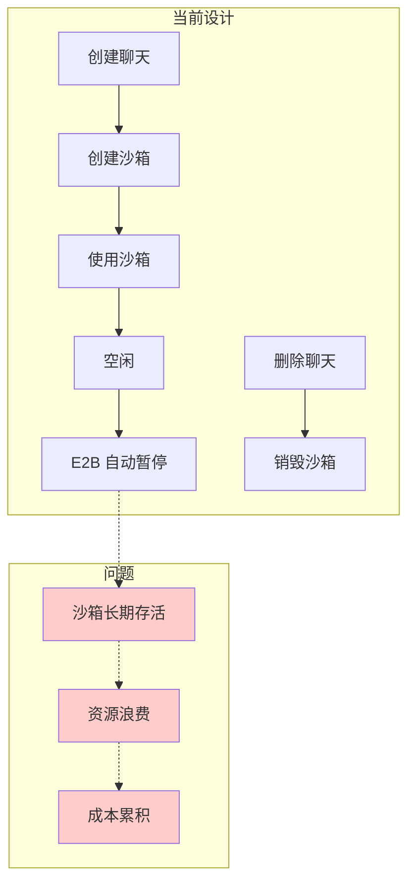
```mermaid
graph TB
    subgraph "当前设计"
        CREATE[创建聊天] --> SANDBOX[创建沙箱]
        SANDBOX --> USE[使用沙箱]
        USE --> IDLE[空闲]
        IDLE --> PAUSE[E2B 自动暂停]
        DELETE[删除聊天] --> KILL[销毁沙箱]
    end

    subgraph "问题"
        P1[沙箱长期存活]
        P2[资源浪费]
        P3[成本累积]
    end

    PAUSE -.-> P1
    P1 -.-> P2
    P2 -.-> P3

    style P1 fill:#fcc
    style P2 fill:#fcc
    style P3 fill:#fcc
```

**问题**：
- 用户创建聊天后可能长时间不使用
- 沙箱即使暂停也会占用 E2B 配额
- 没有主动的资源回收机制

### 2.2 问题二：1:1 的聊天-沙箱关系

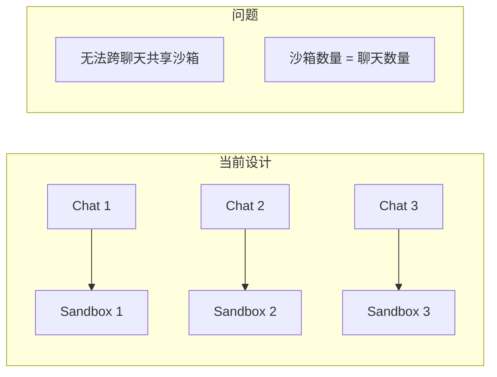
```mermaid
graph LR
    subgraph "当前设计"
        C1[Chat 1] --> S1[Sandbox 1]
        C2[Chat 2] --> S2[Sandbox 2]
        C3[Chat 3] --> S3[Sandbox 3]
    end

    subgraph "问题"
        P1[无法跨聊天共享沙箱]
        P2[沙箱数量 = 聊天数量]
    end
```

**问题**：
- 每个聊天都有独立沙箱
- 用户有 10 个聊天就有 10 个沙箱
- 无法在聊天间共享工作环境

### 2.3 问题三：数据同步时机

```python
# 当前：每次消息发送时都调用 initialize_sandbox
async def initialize_sandbox(
    self,
    sandbox_id: str,
    github_token: str | None = None,
    custom_skills: list[CustomSkillDict] | None = None,
    ...
):
    tasks = [
        self._start_openvscode_server(sandbox_id),
        self._copy_all_resources_to_sandbox(...),  # 每次都复制
        self._setup_github_token(sandbox_id, github_token),
    ]
    await asyncio.gather(*tasks)
```

**问题**：
- `_copy_all_resources_to_sandbox` 每次都打包并上传 skills/commands/agents
- 如果用户有大量 skills（每个 1MB），每次消息都要传输
- 重复的初始化操作

## 3. prepare_user_prompt 分析

### 3.1 当前实现

```python
def prepare_user_prompt(
    self,
    prompt: str,
    custom_instructions: str | None,
    attachments: list[dict[str, Any]] | None = None,
) -> str:
    parts = []

    # 1. 添加自定义指令
    if custom_instructions:
        parts.append(f"<user_instructions>\n{custom_instructions}\n</user_instructions>")

    # 2. 添加附件路径引用
    if attachments:
        files_list = "\n".join(
            f"- /home/user/{attachment['file_path'].split('/')[-1]}"
            for attachment in attachments
        )
        parts.append(f"<user_attachments>\n{files_list}\n</user_attachments>")

    # 3. 添加用户提示
    parts.append(f"<user_prompt>{prompt}</user_prompt>")
    return "".join(parts)
```

### 3.2 这个实现是合理的

**关键点**：`prepare_user_prompt` **不传输文件内容**，只是构建提示文本。

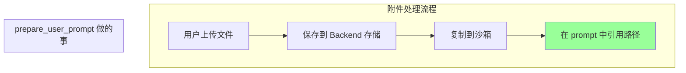
```mermaid
graph TB
    subgraph "附件处理流程"
        UPLOAD[用户上传文件]
        SAVE[保存到 Backend 存储]
        COPY[复制到沙箱]
        REF[在 prompt 中引用路径]
    end

    UPLOAD --> SAVE
    SAVE --> COPY
    COPY --> REF

    subgraph "prepare_user_prompt 做的事"
        style REF fill:#9f9
    end
```

**不是问题**：
- 文件已经在之前的步骤中复制到沙箱
- `prepare_user_prompt` 只是生成路径引用字符串
- 不涉及大数据传输

### 3.3 真正的数据传输瓶颈

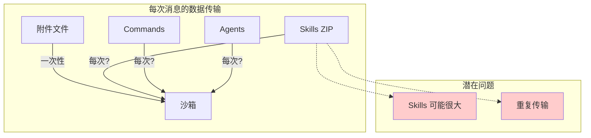
```mermaid
graph TB
    subgraph "每次消息的数据传输"
        A1[附件文件] -->|一次性| S[沙箱]
        A2[Skills ZIP] -->|每次?| S
        A3[Commands] -->|每次?| S
        A4[Agents] -->|每次?| S
    end

    subgraph "潜在问题"
        P1[Skills 可能很大]
        P2[重复传输]
    end

    A2 -.-> P1
    A2 -.-> P2

    style P1 fill:#fcc
    style P2 fill:#fcc
```

## 4. 最佳实践建议

### 4.1 沙箱池化（Sandbox Pooling）

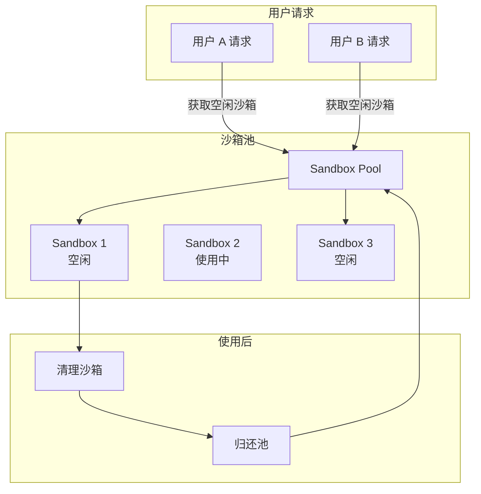
```mermaid
graph TB
    subgraph "沙箱池"
        POOL[Sandbox Pool]
        S1[Sandbox 1<br/>空闲]
        S2[Sandbox 2<br/>使用中]
        S3[Sandbox 3<br/>空闲]
    end

    subgraph "用户请求"
        R1[用户 A 请求]
        R2[用户 B 请求]
    end

    R1 -->|获取空闲沙箱| POOL
    POOL --> S1
    R2 -->|获取空闲沙箱| POOL
    POOL --> S3

    subgraph "使用后"
        CLEAN[清理沙箱]
        RETURN[归还池]
    end

    S1 --> CLEAN
    CLEAN --> RETURN
    RETURN --> POOL
```

**实现要点**：
```python
class SandboxPool:
    def __init__(self, min_size: int = 2, max_size: int = 10):
        self.available: asyncio.Queue[AsyncSandbox] = asyncio.Queue()
        self.in_use: set[str] = set()

    async def acquire(self) -> AsyncSandbox:
        """获取一个可用沙箱"""
        try:
            sandbox = self.available.get_nowait()
        except asyncio.QueueEmpty:
            sandbox = await self._create_new()

        self.in_use.add(sandbox.sandbox_id)
        return sandbox

    async def release(self, sandbox: AsyncSandbox):
        """归还沙箱到池中"""
        await self._cleanup_sandbox(sandbox)
        self.in_use.discard(sandbox.sandbox_id)
        await self.available.put(sandbox)

    async def _cleanup_sandbox(self, sandbox: AsyncSandbox):
        """清理沙箱状态，准备复用"""
        await sandbox.commands.run("rm -rf /home/user/* /home/user/.*")
        await sandbox.commands.run("cd /home/user")
```

### 4.2 分层资源管理

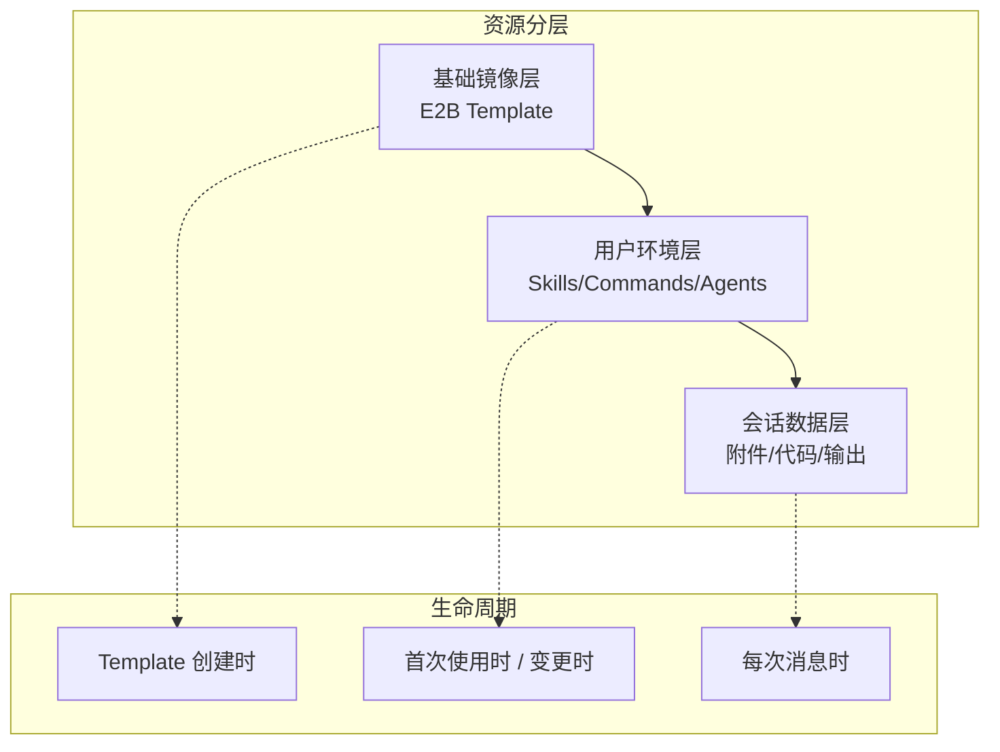
```mermaid
graph TB
    subgraph "资源分层"
        L1[基础镜像层<br/>E2B Template]
        L2[用户环境层<br/>Skills/Commands/Agents]
        L3[会话数据层<br/>附件/代码/输出]
    end

    L1 --> L2
    L2 --> L3

    subgraph "生命周期"
        LT1[Template 创建时]
        LT2[首次使用时 / 变更时]
        LT3[每次消息时]
    end

    L1 -.-> LT1
    L2 -.-> LT2
    L3 -.-> LT3
```

**优化策略**：

```python
class OptimizedSandboxService:
    def __init__(self):
        self._user_env_cache: dict[str, str] = {}  # user_id -> 环境hash

    async def initialize_sandbox(self, sandbox_id: str, user_id: str, ...):
        # 计算用户环境 hash
        env_hash = self._compute_env_hash(custom_skills, custom_commands)

        # 检查是否需要重新同步
        if self._user_env_cache.get(user_id) != env_hash:
            await self._sync_user_resources(sandbox_id, user_id, ...)
            self._user_env_cache[user_id] = env_hash
        else:
            logger.info(f"User {user_id} resources unchanged, skipping sync")

    def _compute_env_hash(self, skills, commands) -> str:
        """计算资源配置的 hash"""
        config = {
            "skills": sorted([s["name"] for s in skills or []]),
            "commands": sorted([c["name"] for c in commands or []]),
        }
        return hashlib.md5(json.dumps(config).encode()).hexdigest()
```

### 4.3 惰性资源加载

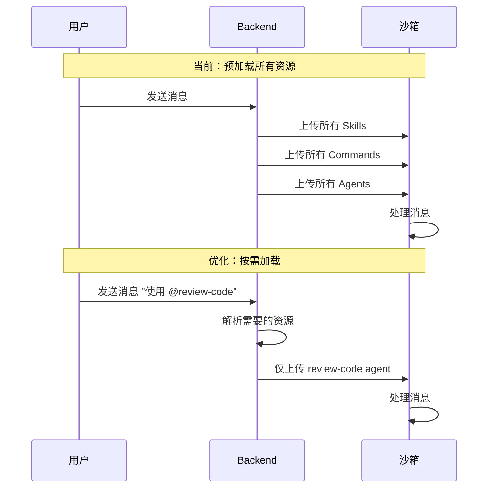
```mermaid
sequenceDiagram
    participant User as 用户
    participant Backend as Backend
    participant Sandbox as 沙箱

    Note over User,Sandbox: 当前：预加载所有资源
    User->>Backend: 发送消息
    Backend->>Sandbox: 上传所有 Skills
    Backend->>Sandbox: 上传所有 Commands
    Backend->>Sandbox: 上传所有 Agents
    Sandbox->>Sandbox: 处理消息

    Note over User,Sandbox: 优化：按需加载
    User->>Backend: 发送消息 "使用 @review-code"
    Backend->>Backend: 解析需要的资源
    Backend->>Sandbox: 仅上传 review-code agent
    Sandbox->>Sandbox: 处理消息
```

**实现**：
```python
async def _lazy_load_resources(
    self,
    sandbox_id: str,
    prompt: str,
    user_resources: UserResources,
):
    """按需加载资源"""
    needed_skills = self._detect_needed_skills(prompt)
    needed_agents = self._detect_needed_agents(prompt)

    for skill_name in needed_skills:
        if skill_name not in self._loaded_resources[sandbox_id]:
            await self._load_single_skill(sandbox_id, skill_name)
            self._loaded_resources[sandbox_id].add(skill_name)

def _detect_needed_skills(self, prompt: str) -> set[str]:
    """从 prompt 中检测需要的 skills"""
    # 检测 /skill:xxx 模式
    pattern = r'/skill:(\w+)'
    matches = re.findall(pattern, prompt)
    return set(matches)
```

### 4.4 沙箱生命周期策略

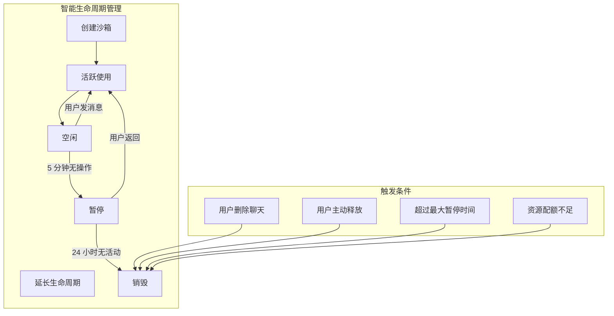
```mermaid
graph TB
    subgraph "智能生命周期管理"
        CREATE[创建沙箱]
        ACTIVE[活跃使用]
        IDLE[空闲]
        PAUSE[暂停]
        EXTEND[延长生命周期]
        DESTROY[销毁]
    end

    CREATE --> ACTIVE
    ACTIVE --> IDLE
    IDLE -->|5 分钟无操作| PAUSE
    IDLE -->|用户发消息| ACTIVE
    PAUSE -->|用户返回| ACTIVE
    PAUSE -->|24 小时无活动| DESTROY

    subgraph "触发条件"
        T1[用户删除聊天]
        T2[用户主动释放]
        T3[超过最大暂停时间]
        T4[资源配额不足]
    end

    T1 --> DESTROY
    T2 --> DESTROY
    T3 --> DESTROY
    T4 --> DESTROY
```

**策略配置**：
```python
SANDBOX_LIFECYCLE_CONFIG = {
    "idle_pause_timeout": 5 * 60,      # 5 分钟空闲后暂停
    "max_pause_duration": 24 * 3600,   # 最长暂停 24 小时
    "max_active_duration": 7 * 24 * 3600,  # 最长存活 7 天
    "cleanup_batch_size": 10,          # 批量清理数量
}
```

### 4.5 增量资源同步

```python
class IncrementalResourceSync:
    """增量资源同步器"""

    def __init__(self):
        self._sync_state: dict[str, ResourceSyncState] = {}

    async def sync_resources(
        self,
        sandbox_id: str,
        user_id: str,
        resources: UserResources,
    ):
        current_state = self._sync_state.get(sandbox_id)

        if not current_state:
            # 首次同步：全量
            await self._full_sync(sandbox_id, resources)
            self._sync_state[sandbox_id] = ResourceSyncState(
                skills=set(resources.skill_names),
                commands=set(resources.command_names),
                last_sync=datetime.now(),
            )
        else:
            # 增量同步
            added, removed = self._diff_resources(current_state, resources)

            for skill in added.skills:
                await self._add_skill(sandbox_id, skill)

            for skill in removed.skills:
                await self._remove_skill(sandbox_id, skill)

            self._sync_state[sandbox_id].update(resources)
```

## 5. 参考 Manus 的设计理念

### 5.1 Manus 的核心设计原则

1. **计算机即工具**：沙箱是一个完整的计算机环境，不只是代码执行器
2. **状态持久化**：用户的工作环境应该被保留
3. **资源效率**：最小化资源消耗和数据传输

### 5.2 推荐架构

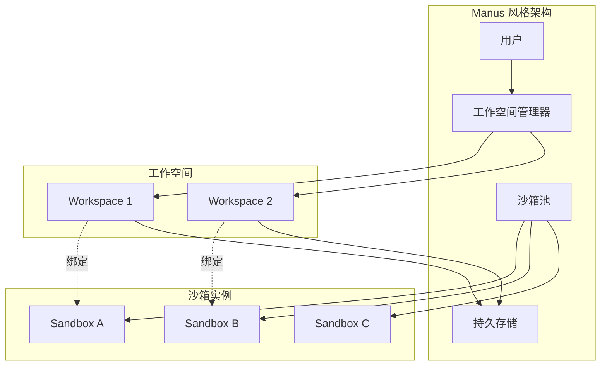
```mermaid
graph TB
    subgraph "Manus 风格架构"
        USER[用户]
        WORKSPACE[工作空间管理器]
        POOL[沙箱池]
        STORAGE[持久存储]
    end

    subgraph "工作空间"
        WS1[Workspace 1]
        WS2[Workspace 2]
    end

    subgraph "沙箱实例"
        S1[Sandbox A]
        S2[Sandbox B]
        S3[Sandbox C]
    end

    USER --> WORKSPACE
    WORKSPACE --> WS1
    WORKSPACE --> WS2
    WS1 -.->|绑定| S1
    WS2 -.->|绑定| S2
    POOL --> S1
    POOL --> S2
    POOL --> S3

    WS1 --> STORAGE
    WS2 --> STORAGE
```

### 5.3 工作空间模型

```python
class Workspace:
    """工作空间：用户的持久化工作环境"""
    id: str
    user_id: str
    name: str
    sandbox_id: str | None  # 当前绑定的沙箱
    state: WorkspaceState   # active, paused, archived

    # 工作空间配置
    resources: WorkspaceResources
    environment: dict[str, str]

    # 状态快照
    last_snapshot_id: str | None
    snapshot_interval: int  # 自动快照间隔

class Chat:
    """聊天：工作空间中的对话"""
    id: str
    workspace_id: str  # 关联工作空间，而非沙箱
    messages: list[Message]
```

### 5.4 状态快照机制

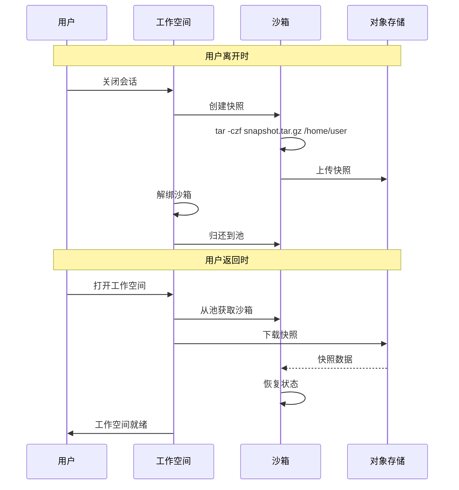
```mermaid
sequenceDiagram
    participant User as 用户
    participant WS as 工作空间
    participant Sandbox as 沙箱
    participant Storage as 对象存储

    Note over User,Storage: 用户离开时
    User->>WS: 关闭会话
    WS->>Sandbox: 创建快照
    Sandbox->>Sandbox: tar -czf snapshot.tar.gz /home/user
    Sandbox->>Storage: 上传快照
    WS->>WS: 解绑沙箱
    WS->>Sandbox: 归还到池

    Note over User,Storage: 用户返回时
    User->>WS: 打开工作空间
    WS->>Sandbox: 从池获取沙箱
    WS->>Storage: 下载快照
    Storage-->>Sandbox: 快照数据
    Sandbox->>Sandbox: 恢复状态
    WS->>User: 工作空间就绪
```

## 6. 总结与建议

### 6.1 当前实现评估

| 方面 | 当前实现 | 问题 | 严重程度 |
|------|----------|------|----------|
| 沙箱销毁 | 仅删除聊天时 | 资源浪费 | ⚠️ 中 |
| 资源同步 | 每次都全量 | 效率低 | ⚠️ 中 |
| 生命周期 | 依赖 E2B auto_pause | 不够灵活 | 🔵 低 |
| 聊天-沙箱关系 | 1:1 绑定 | 无法共享 | 🔵 低 |

### 6.2 优先级建议

1. **P0 - 立即优化**：增量资源同步（减少重复传输）
2. **P1 - 短期优化**：添加主动清理策略（定时清理空闲沙箱）
3. **P2 - 中期优化**：沙箱池化（提高资源利用率）
4. **P3 - 长期优化**：工作空间模型（Manus 风格）

### 6.3 `prepare_user_prompt` 结论

**这个实现是合理的**：
- 只生成路径引用，不传输文件内容
- 文件已在之前上传到沙箱
- 即使有大量附件，也只是路径字符串列表

**真正需要优化的是**：
- `_copy_all_resources_to_sandbox` 的增量同步
- 沙箱生命周期的主动管理

## 7. 沙箱初始化优化深度分析

### 7.1 当前初始化流程

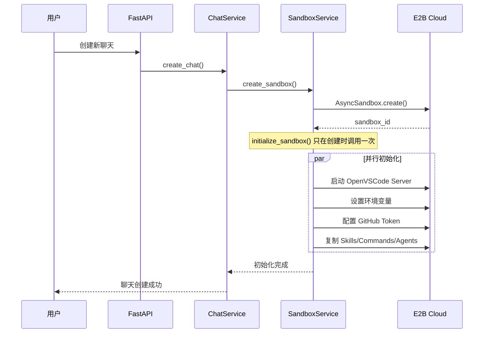
```mermaid
sequenceDiagram
    participant User as 用户
    participant API as FastAPI
    participant Chat as ChatService
    participant Sandbox as SandboxService
    participant E2B as E2B Cloud

    User->>API: 创建新聊天
    API->>Chat: create_chat()
    Chat->>Sandbox: create_sandbox()
    Sandbox->>E2B: AsyncSandbox.create()
    E2B-->>Sandbox: sandbox_id

    Note over Sandbox: initialize_sandbox() 只在创建时调用一次

    par 并行初始化
        Sandbox->>E2B: 启动 OpenVSCode Server
        Sandbox->>E2B: 设置环境变量
        Sandbox->>E2B: 配置 GitHub Token
        Sandbox->>E2B: 复制 Skills/Commands/Agents
    end

    Sandbox-->>Chat: 初始化完成
    Chat-->>User: 聊天创建成功
```

**关键发现**：`initialize_sandbox()` **只在聊天创建时调用一次**，不是每条消息都调用。

### 7.2 资源同步的实际问题

```python
# sandbox.py:723-826
async def _copy_all_resources_to_sandbox(
    self,
    sandbox_id: str,
    user_id: str,
    custom_skills: list[CustomSkillDict] | None,
    custom_slash_commands: list[CustomSlashCommandDict] | None,
    custom_agents: list[CustomAgentDict] | None,
) -> None:
    # 1. 从本地文件系统读取所有资源
    enabled_skills = skill_service.get_enabled(user_id, custom_skills or [])
    enabled_commands = command_service.get_enabled(user_id, custom_slash_commands or [])
    enabled_agents = agent_service.get_enabled(user_id, custom_agents or [])

    # 2. 创建 ZIP 包
    with zipfile.ZipFile(zip_buffer, "w", zipfile.ZIP_DEFLATED) as zf:
        for skill in enabled_skills:
            # 读取每个 skill ZIP 并重新打包
            with zipfile.ZipFile(local_zip_path, "r") as skill_zip:
                for item in skill_zip.namelist():
                    content = skill_zip.read(item)
                    zf.writestr(f".claude/skills/{skill_name}/{item}", content)

    # 3. Base64 编码后上传
    encoded_content = base64.b64encode(zip_content).decode("utf-8")
    await self.write_file(sandbox_id, temp_b64_path, encoded_content)

    # 4. 在沙箱中解码并解压
    decode_and_extract_cmd = (
        f"base64 -d {temp_b64_path} > {remote_zip_path} && "
        f"unzip -q -o {remote_zip_path} -d /home/user"
    )
```

**问题分析**：

| 步骤 | 开销 | 可优化性 |
|------|------|----------|
| 读取本地资源 | 低 | - |
| ZIP 压缩 | 中 | 可缓存 |
| Base64 编码 | 低 | - |
| 网络传输 | 高 | 可增量 |
| 沙箱内解压 | 中 | - |

### 7.3 优化方案

#### 方案一：资源预置到 E2B Template

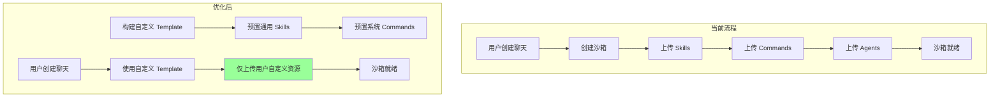
```mermaid
graph TB
    subgraph "当前流程"
        A1[用户创建聊天] --> B1[创建沙箱]
        B1 --> C1[上传 Skills]
        C1 --> D1[上传 Commands]
        D1 --> E1[上传 Agents]
        E1 --> F1[沙箱就绪]
    end

    subgraph "优化后"
        A2[构建自定义 Template] --> B2[预置通用 Skills]
        B2 --> C2[预置系统 Commands]

        A3[用户创建聊天] --> B3[使用自定义 Template]
        B3 --> C3[仅上传用户自定义资源]
        C3 --> D3[沙箱就绪]
    end

    style C3 fill:#9f9
```

**实现**：
```python
# 1. 创建自定义 E2B Template（构建时）
# Dockerfile 或 e2b.toml 配置
# 预置：
# - /home/user/.claude/skills/builtin/
# - /home/user/.claude/commands/builtin/
# - OpenVSCode Server 预启动

# 2. 运行时只同步用户自定义资源
async def initialize_sandbox(self, sandbox_id: str, user_id: str, ...):
    # 只同步用户自定义的资源，跳过内置资源
    user_custom_skills = [s for s in custom_skills if s.get("is_custom")]
    if user_custom_skills:
        await self._copy_user_resources_only(sandbox_id, user_custom_skills)
```

#### 方案二：资源版本化 + 增量同步

```python
class ResourceVersionedSandbox:
    def __init__(self):
        self._sandbox_resource_versions: dict[str, dict[str, str]] = {}
        # sandbox_id -> {resource_name: version_hash}

    async def sync_resources(
        self,
        sandbox_id: str,
        resources: list[ResourceDict],
    ):
        current_versions = self._sandbox_resource_versions.get(sandbox_id, {})
        new_versions = {}
        to_upload = []
        to_delete = []

        for resource in resources:
            name = resource["name"]
            version = self._compute_hash(resource["path"])
            new_versions[name] = version

            if current_versions.get(name) != version:
                to_upload.append(resource)

        # 检测被删除的资源
        for name in current_versions:
            if name not in new_versions:
                to_delete.append(name)

        # 只同步变更的资源
        if to_upload:
            await self._upload_resources(sandbox_id, to_upload)
        if to_delete:
            await self._delete_resources(sandbox_id, to_delete)

        self._sandbox_resource_versions[sandbox_id] = new_versions
```

## 8. 沙箱产物持久化机制

### 8.1 当前持久化方式

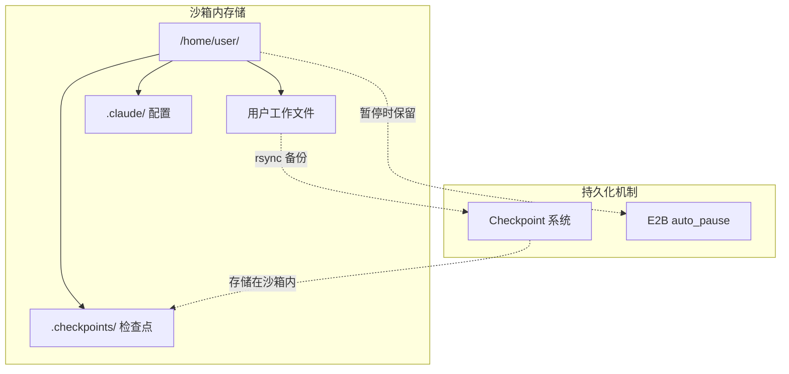
```mermaid
graph TB
    subgraph "沙箱内存储"
        HOME["/home/user/"]
        WORK[用户工作文件]
        CLAUDE[".claude/ 配置"]
        CHECKPOINTS[".checkpoints/ 检查点"]
    end

    subgraph "持久化机制"
        CP[Checkpoint 系统]
        E2B_PAUSE[E2B auto_pause]
    end

    HOME --> WORK
    HOME --> CLAUDE
    HOME --> CHECKPOINTS

    WORK -.->|rsync 备份| CP
    CP -.->|存储在沙箱内| CHECKPOINTS

    HOME -.->|暂停时保留| E2B_PAUSE
```

### 8.2 Checkpoint 机制详解

```python
# sandbox.py:946-1000
async def create_checkpoint(self, sandbox_id: str, message_id: str) -> str:
    # 使用 rsync --link-dest 创建增量备份
    # 未修改的文件使用硬链接，节省空间
    rsync_cmd = (
        f"rsync -a --delete "
        f"--link-dest={prev_checkpoint} "
        f"{exclude_args} "
        f"/home/user/ {checkpoint_dir}/"
    )
```

**特点**：
- ✅ 增量备份（硬链接未修改文件）
- ✅ 可恢复到任意消息状态
- ❌ 仍在沙箱内部存储
- ❌ 沙箱销毁后 Checkpoint 丢失

### 8.3 持久化问题与改进

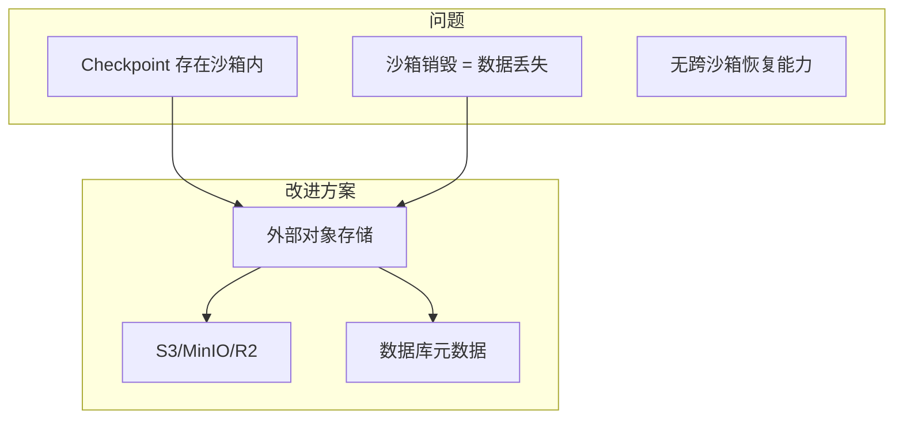
```mermaid
graph TB
    subgraph "问题"
        P1[Checkpoint 存在沙箱内]
        P2[沙箱销毁 = 数据丢失]
        P3[无跨沙箱恢复能力]
    end

    subgraph "改进方案"
        S1[外部对象存储]
        S2[S3/MinIO/R2]
        S3[数据库元数据]
    end

    P1 --> S1
    P2 --> S1
    S1 --> S2
    S1 --> S3
```

**改进实现**：
```python
class ExternalCheckpointService:
    def __init__(self, storage_client: S3Client):
        self.storage = storage_client

    async def create_checkpoint(
        self,
        sandbox_id: str,
        message_id: str,
        sandbox_service: SandboxService,
    ) -> str:
        # 1. 在沙箱内创建 tar.gz
        tar_cmd = "tar -czf /tmp/checkpoint.tar.gz -C /home/user ."
        await sandbox_service.execute_command(sandbox_id, tar_cmd)

        # 2. 下载到服务器
        content = await sandbox_service.download_file(
            sandbox_id, "/tmp/checkpoint.tar.gz"
        )

        # 3. 上传到对象存储
        key = f"checkpoints/{sandbox_id}/{message_id}.tar.gz"
        await self.storage.upload(key, content)

        # 4. 保存元数据到数据库
        await self._save_checkpoint_metadata(sandbox_id, message_id, key)

        return message_id

    async def restore_checkpoint(
        self,
        sandbox_id: str,
        message_id: str,
        sandbox_service: SandboxService,
    ):
        # 1. 从对象存储下载
        key = f"checkpoints/{sandbox_id}/{message_id}.tar.gz"
        content = await self.storage.download(key)

        # 2. 上传到沙箱
        await sandbox_service.upload_file(
            sandbox_id, "/tmp/restore.tar.gz", content
        )

        # 3. 解压恢复
        await sandbox_service.execute_command(
            sandbox_id,
            "rm -rf /home/user/* && tar -xzf /tmp/restore.tar.gz -C /home/user"
        )
```

## 9. Manus 架构对比分析

### 9.1 核心架构差异


```mermaid
graph TB
    subgraph "Claudex 架构"
        USER1[用户] --> BE1[Backend]
        BE1 --> SDK1[Claude Agent SDK]
        SDK1 -->|Transport| SB1[E2B Sandbox]
        SB1 -->|内置| CLI1[Claude CLI]
        CLI1 -->|API 调用| CLAUDE1[Claude API]

        style CLI1 fill:#fcc
        style SB1 fill:#ffc
    end

    subgraph "Manus 架构"
        USER2[用户] --> BE2[Backend]
        BE2 --> AI2[AI Model]
        AI2 -->|Tool Calls| TOOL2[Tool Executor]
        TOOL2 -->|执行命令| SB2[E2B Sandbox]

        style AI2 fill:#9f9
        style SB2 fill:#ffc
    end
```

### 9.2 关键区别

| 方面 | Claudex | Manus |
|------|---------|-------|
| **AI 运行位置** | 沙箱内 (Claude CLI) | 服务器端 |
| **沙箱用途** | AI 运行环境 + 代码执行 | 纯代码执行环境 |
| **Tool 执行** | Claude CLI 内部处理 | 服务器端 Tool Executor |
| **API 调用** | 从沙箱发起 | 从服务器发起 |
| **资源需求** | 高（需要运行 AI） | 低（只执行命令） |

### 9.3 Manus 沙箱模型

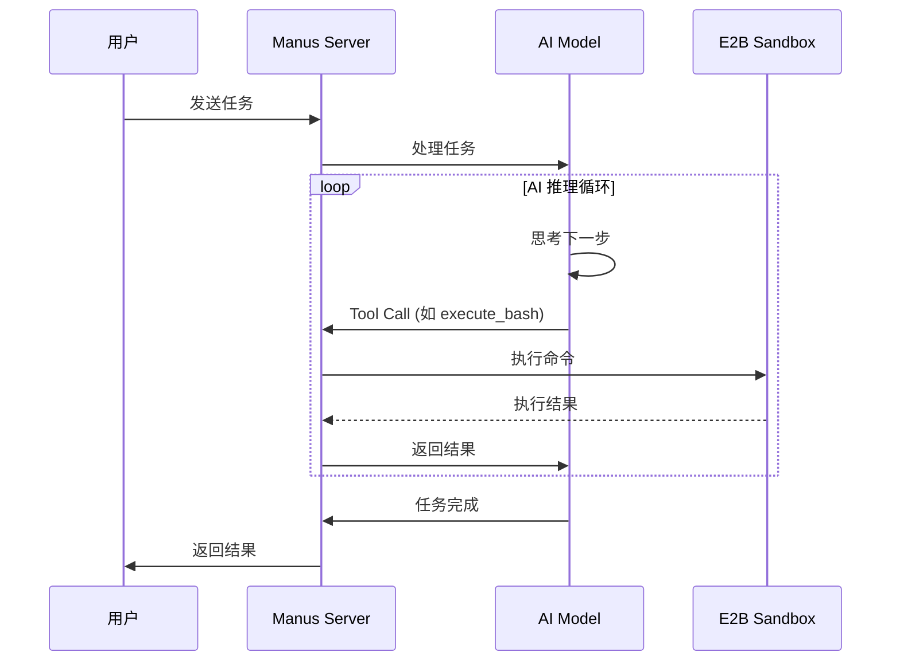
```mermaid
sequenceDiagram
    participant User as 用户
    participant Server as Manus Server
    participant AI as AI Model
    participant Sandbox as E2B Sandbox

    User->>Server: 发送任务
    Server->>AI: 处理任务

    loop AI 推理循环
        AI->>AI: 思考下一步
        AI->>Server: Tool Call (如 execute_bash)
        Server->>Sandbox: 执行命令
        Sandbox-->>Server: 执行结果
        Server->>AI: 返回结果
    end

    AI->>Server: 任务完成
    Server->>User: 返回结果
```

**Manus 不在沙箱中安装 Claude CLI**：
- Manus 使用自己的 AI 模型
- AI 推理在服务器端完成
- 沙箱只是一个远程执行环境
- 通过 Tool Calls 模式执行代码

### 9.4 为什么 Claudex 选择在沙箱中运行 Claude CLI

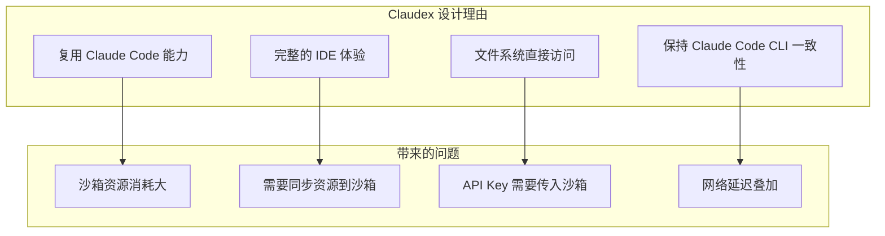
```mermaid
graph TB
    subgraph "Claudex 设计理由"
        R1[复用 Claude Code 能力]
        R2[完整的 IDE 体验]
        R3[文件系统直接访问]
        R4[保持 Claude Code CLI 一致性]
    end

    subgraph "带来的问题"
        P1[沙箱资源消耗大]
        P2[需要同步资源到沙箱]
        P3[API Key 需要传入沙箱]
        P4[网络延迟叠加]
    end

    R1 --> P1
    R2 --> P2
    R3 --> P3
    R4 --> P4
```

### 9.5 替代架构方案

#### 方案 A：Manus 风格（服务器端 AI）

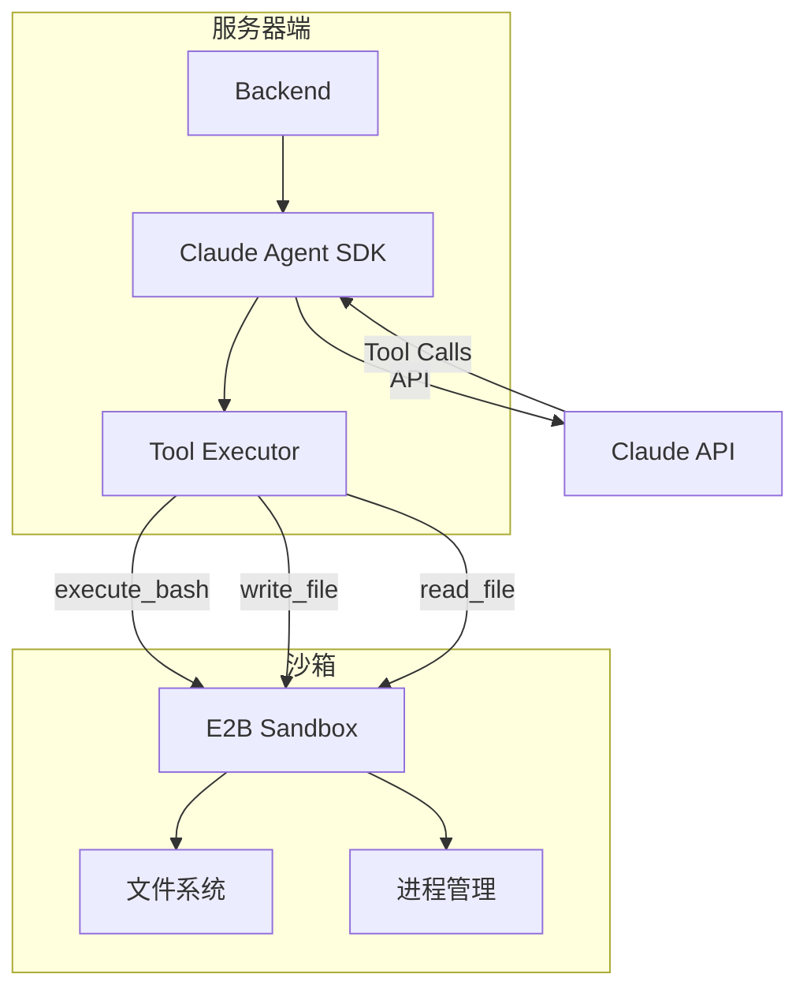
```mermaid
graph TB
    subgraph "服务器端"
        BE[Backend]
        SDK[Claude Agent SDK]
        EXECUTOR[Tool Executor]
    end

    subgraph "沙箱"
        SB[E2B Sandbox]
        FS[文件系统]
        PROC[进程管理]
    end

    BE --> SDK
    SDK -->|API| CLAUDE[Claude API]
    CLAUDE -->|Tool Calls| SDK
    SDK --> EXECUTOR
    EXECUTOR -->|execute_bash| SB
    EXECUTOR -->|write_file| SB
    EXECUTOR -->|read_file| SB
    SB --> FS
    SB --> PROC
```

**实现要点**：
```python
class ServerSideAgentService:
    def __init__(self, sandbox_service: SandboxService):
        self.sandbox = sandbox_service
        self.tools = self._build_tools()

    def _build_tools(self) -> list[Tool]:
        return [
            Tool(
                name="execute_bash",
                description="Execute a bash command in the sandbox",
                input_schema={...},
                handler=self._execute_bash,
            ),
            Tool(
                name="write_file",
                description="Write content to a file",
                input_schema={...},
                handler=self._write_file,
            ),
            # ... 更多 tools
        ]

    async def _execute_bash(
        self, sandbox_id: str, command: str
    ) -> str:
        return await self.sandbox.execute_command(sandbox_id, command)

    async def process_message(
        self,
        sandbox_id: str,
        user_message: str,
    ) -> AsyncIterator[StreamEvent]:
        # 使用 Anthropic API 直接调用
        async with anthropic.AsyncClient() as client:
            response = await client.messages.create(
                model="claude-sonnet-4-20250514",
                messages=[{"role": "user", "content": user_message}],
                tools=self.tools,
            )

            # 处理 tool calls
            while response.stop_reason == "tool_use":
                tool_results = []
                for block in response.content:
                    if block.type == "tool_use":
                        result = await self._execute_tool(
                            sandbox_id, block.name, block.input
                        )
                        tool_results.append(result)

                response = await client.messages.create(
                    model="claude-sonnet-4-20250514",
                    messages=[...],  # 包含 tool results
                    tools=self.tools,
                )

            yield from self._stream_response(response)
```

**优势**：
- ✅ 沙箱资源消耗低
- ✅ 无需同步 Claude CLI 资源
- ✅ API Key 不进入沙箱
- ✅ 更灵活的工具定制

**劣势**：
- ❌ 失去 Claude Code 内置能力
- ❌ 需要自己实现所有 tools
- ❌ 可能与 Claude Code 行为不一致

#### 方案 B：混合架构（推荐）

```mermaid
graph TB
    subgraph "服务器端"
        BE[Backend]
        SDK[Claude Agent SDK]
        TOOLS[自定义 Tools]
    end

    subgraph "沙箱"
        SB[E2B Sandbox]
        CLI[Claude CLI - 按需]
    end

    BE --> SDK
    SDK -->|简单任务| TOOLS
    TOOLS --> SB

    SDK -->|复杂任务| CLI
    CLI --> SB
```

**实现**：
```python
class HybridAgentService:
    async def process_message(
        self, sandbox_id: str, user_message: str, complexity: str
    ):
        if complexity == "simple":
            # 简单任务：服务器端直接处理
            return await self._process_with_server_tools(
                sandbox_id, user_message
            )
        else:
            # 复杂任务：使用沙箱内的 Claude CLI
            return await self._process_with_sandbox_cli(
                sandbox_id, user_message
            )
```

## 10. 优化建议优先级更新

| 优先级 | 优化项 | 预期收益 | 实现难度 |
|--------|--------|----------|----------|
| **P0** | 资源预置到 E2B Template | 高 | 中 |
| **P0** | 外部 Checkpoint 存储 | 高 | 中 |
| **P1** | 增量资源同步 | 中 | 低 |
| **P1** | 沙箱池化 | 中 | 高 |
| **P2** | 混合架构（简单任务服务器端处理） | 高 | 高 |
| **P3** | 完全 Manus 风格重构 | 极高 | 极高 |

### 10.1 立即可执行的优化

```python
# 1. 创建自定义 E2B Template (e2b.toml)
# 预置常用工具和配置

# 2. 添加资源版本检查
class OptimizedSandboxService(SandboxService):
    _resource_cache: dict[str, bytes] = {}  # 类级别缓存

    async def _copy_all_resources_to_sandbox(self, ...):
        # 计算资源 hash
        resource_hash = self._compute_resources_hash(
            custom_skills, custom_slash_commands, custom_agents
        )

        # 检查缓存
        if resource_hash in self._resource_cache:
            zip_content = self._resource_cache[resource_hash]
        else:
            zip_content = self._build_resources_zip(...)
            self._resource_cache[resource_hash] = zip_content

        # 上传到沙箱
        await self._upload_and_extract(sandbox_id, zip_content)

# 3. 外部 Checkpoint 存储
# 使用 S3/MinIO 存储 checkpoint，数据库存储元数据
```
